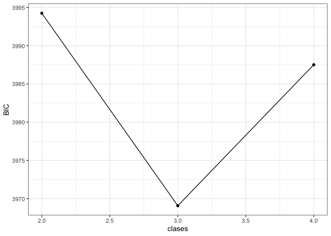
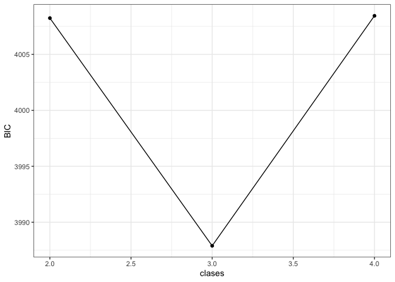
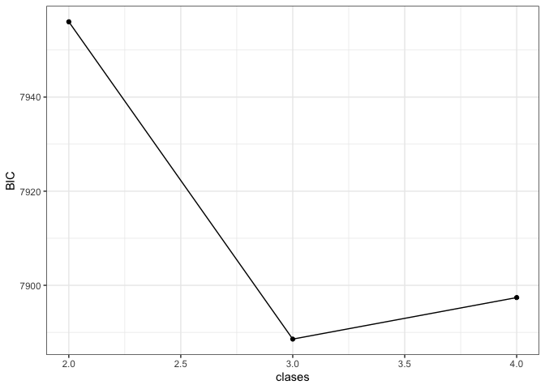

Code 01: numero de clases
================
dacarras
Noviembre 23, 2022

# Cargar datos

## Cargar datos desde archivo

``` r
#--------------------------------------------------------------------
# load data
#--------------------------------------------------------------------

#------------------------------------------------
# load data from file
#------------------------------------------------

data_civ <- readRDS('data_civ.rds') # pooled
data_exp <- readRDS('data_exp.rds') # exploratory
data_con <- readRDS('data_con.rds') # confirmatory
```

# Descriptivos

## Items

``` r
#--------------------------------------------------------------------
# item
#--------------------------------------------------------------------

#------------------------------------------------
# item info
#------------------------------------------------

items_table <- read.table(
text="
var_name  variable item_text
IS3G23A   n01      'Voting in every national election'
IS3G23B   n02      'Joining a political party'
IS3G23C   n03      'Learning about the country history'
IS3G23D   n04      'Following political issues in the newspaper, on theradio, on TV or on the Internet'
IS3G23E   n05      'Showing respect for government representatives'
IS3G23F   n06      'Engaging in political discussions'
IS3G23G   n07      'Participating in peaceful protests against laws believed to be unjust'
IS3G23H   n08      'Participating in activities to benefit people in the <local community>'
IS3G23I   n09      'Taking part in activities promoting human rights'
IS3G23J   n10      'Taking part in activities to protect the environment'
IS3G23K   n11      'Working hard'
IS3G23L   n12      'Always obeying the law'
IS3G22A   td1      '[R] Political leaders give government jobs to their family members.'
IS3G22B   td2      '[R] One company or the government owns all newspapers in a country.'
IS3G22C   td3      'People are allowed to publicly criticize the government.'
IS3G22D   td4      'All adult citizens have the right to elect their political leaders.'
IS3G22E   td5      'People are able to protest if they think a law is unfair.'
IS3G22F   td6      '[R] The police have the right to hold people suspected of threatening national security in jail without trial.'
IS3G22G   td7      'Differences in income between poor and rich people are small.'
IS3G22H   td8      '[R] The government influences decisions by courts of justice.'
IS3G22I   td9      'All <ethnic/racial> groups in the country have the same rights.'
",
header=TRUE, stringsAsFactors = FALSE)

# display item table
knitr::kable(items_table)
```

| var_name | variable | item_text                                                                                                        |
|:---------|:---------|:-----------------------------------------------------------------------------------------------------------------|
| IS3G23A  | n01      | Voting in every national election                                                                                |
| IS3G23B  | n02      | Joining a political party                                                                                        |
| IS3G23C  | n03      | Learning about the country history                                                                               |
| IS3G23D  | n04      | Following political issues in the newspaper, on theradio, on TV or on the Internet                               |
| IS3G23E  | n05      | Showing respect for government representatives                                                                   |
| IS3G23F  | n06      | Engaging in political discussions                                                                                |
| IS3G23G  | n07      | Participating in peaceful protests against laws believed to be unjust                                            |
| IS3G23H  | n08      | Participating in activities to benefit people in the <local community>                                           |
| IS3G23I  | n09      | Taking part in activities promoting human rights                                                                 |
| IS3G23J  | n10      | Taking part in activities to protect the environment                                                             |
| IS3G23K  | n11      | Working hard                                                                                                     |
| IS3G23L  | n12      | Always obeying the law                                                                                           |
| IS3G22A  | td1      | \[R\] Political leaders give government jobs to their family members.                                            |
| IS3G22B  | td2      | \[R\] One company or the government owns all newspapers in a country.                                            |
| IS3G22C  | td3      | People are allowed to publicly criticize the government.                                                         |
| IS3G22D  | td4      | All adult citizens have the right to elect their political leaders.                                              |
| IS3G22E  | td5      | People are able to protest if they think a law is unfair.                                                        |
| IS3G22F  | td6      | \[R\] The police have the right to hold people suspected of threatening national security in jail without trial. |
| IS3G22G  | td7      | Differences in income between poor and rich people are small.                                                    |
| IS3G22H  | td8      | \[R\] The government influences decisions by courts of justice.                                                  |
| IS3G22I  | td9      | All <ethnic/racial> groups in the country have the same rights.                                                  |

``` r
#------------------------------------------------
# item selection
#------------------------------------------------

items_selected <- read.table(
text="
var_name  variable item_text
IS3G22D   td4      'All adult citizens have the right to elect their political leaders.'
IS3G22I   td9      'All <ethnic/racial> groups in the country have the same rights.'
IS3G22E   td5      'People are able to protest if they think a law is unfair.'
IS3G22H   td8      '[R] The government influences decisions by courts of justice.'
IS3G22B   td2      '[R] One company or the government owns all newspapers in a country.'
",
header=TRUE, stringsAsFactors = FALSE)

# display item table
knitr::kable(items_selected)
```

| var_name | variable | item_text                                                             |
|:---------|:---------|:----------------------------------------------------------------------|
| IS3G22D  | td4      | All adult citizens have the right to elect their political leaders.   |
| IS3G22I  | td9      | All <ethnic/racial> groups in the country have the same rights.       |
| IS3G22E  | td5      | People are able to protest if they think a law is unfair.             |
| IS3G22H  | td8      | \[R\] The government influences decisions by courts of justice.       |
| IS3G22B  | td2      | \[R\] One company or the government owns all newspapers in a country. |

## Proporciones de respuesta

``` r
#--------------------------------------------------------------------
# load data
#--------------------------------------------------------------------

#------------------------------------------------
# exploratory sample
#------------------------------------------------

data_exp %>%
dplyr::select(td4, td9, td5, td8, td2) %>%
ilsa::wide_resp() %>%
knitr::kable(., digits = 2)
```

| variable |   00 |   01 |   NA | hist     |
|:---------|-----:|-----:|-----:|:---------|
| td4      | 0.17 | 0.80 | 0.03 | ▂▁▁▁▁▁▁▇ |
| td9      | 0.37 | 0.61 | 0.03 | ▅▁▁▁▁▁▁▇ |
| td5      | 0.36 | 0.61 | 0.03 | ▅▁▁▁▁▁▁▇ |
| td8      | 0.70 | 0.27 | 0.03 | ▇▁▁▁▁▁▁▃ |
| td2      | 0.52 | 0.45 | 0.03 | ▇▁▁▁▁▁▁▇ |

``` r
#------------------------------------------------
# confirmatory sample
#------------------------------------------------

data_con %>%
dplyr::select(td4, td9, td5, td8, td2) %>%
ilsa::wide_resp() %>%
knitr::kable(., digits = 2)
```

| variable |   00 |   01 |   NA | hist     |
|:---------|-----:|-----:|-----:|:---------|
| td4      | 0.19 | 0.79 | 0.02 | ▂▁▁▁▁▁▁▇ |
| td9      | 0.38 | 0.60 | 0.02 | ▅▁▁▁▁▁▁▇ |
| td5      | 0.31 | 0.66 | 0.02 | ▃▁▁▁▁▁▁▇ |
| td8      | 0.72 | 0.24 | 0.03 | ▇▁▁▁▁▁▁▃ |
| td2      | 0.53 | 0.45 | 0.03 | ▇▁▁▁▁▁▁▇ |

``` r
#------------------------------------------------
# pooled sample
#------------------------------------------------

data_civ %>%
dplyr::select(td4, td9, td5, td8, td2) %>%
ilsa::wide_resp() %>%
knitr::kable(., digits = 2)
```

| variable |   00 |   01 |   NA | hist     |
|:---------|-----:|-----:|-----:|:---------|
| td4      | 0.18 | 0.80 | 0.03 | ▂▁▁▁▁▁▁▇ |
| td9      | 0.37 | 0.60 | 0.03 | ▅▁▁▁▁▁▁▇ |
| td5      | 0.34 | 0.64 | 0.03 | ▅▁▁▁▁▁▁▇ |
| td8      | 0.71 | 0.26 | 0.03 | ▇▁▁▁▁▁▁▃ |
| td2      | 0.52 | 0.45 | 0.03 | ▇▁▁▁▁▁▁▇ |

# Mixture Modelling

## Ecuación

``` r
#------------------------------------------------------------------------------
# lca modelling
#------------------------------------------------------------------------------

# -----------------------------------------------
# class model
# -----------------------------------------------

class_model <- glca::item(td4, td9, td5, td8, td2) ~ 1
```

## Número de clases (exploratory)

``` r
#------------------------------------------------------------------------------
# lca modelling
#------------------------------------------------------------------------------

# -----------------------------------------------
# number of classes
# -----------------------------------------------

ec2 <- glca::glca(class_model, data = data_exp, nclass = 2, seed = 1, verbose = FALSE)
ec3 <- glca::glca(class_model, data = data_exp, nclass = 3, seed = 1, verbose = FALSE)
ec4 <- glca::glca(class_model, data = data_exp, nclass = 4, seed = 1, verbose = FALSE)

# -----------------------------------------------
# model comparison
# -----------------------------------------------

fit_exp <- glca::gofglca(ec2, ec3, ec4, nboot = 100, test = 'boot', seed = 20221122)

# -----------------------------------------------
# fit table
# -----------------------------------------------

fit_table_exp <- fit_exp$gtable %>%
                 tibble::as_tibble() %>%
                 mutate(clases = c(2,3,4)) %>%
                 mutate(SIC = -.5*BIC) %>% 
                 mutate(cmP = exp(SIC-max(SIC))/sum(exp(SIC-max(SIC)))) %>%
                 mutate(BF = exp(SIC - dplyr::lead(SIC)))

# -----------------------------------------------
# display table
# -----------------------------------------------

fit_table_exp %>%
knitr::kable(., digits = 2)
```

| logLik |  AIC | CAIC |  BIC | entropy | Res.Df | Gsq | Boot p-value | clases |   SIC | cmP |    BF |
|-------:|-----:|-----:|-----:|--------:|-------:|----:|-------------:|-------:|------:|----:|------:|
|  -1961 | 3944 | 4005 | 3994 |    0.70 |     20 | 102 |          0.0 |      2 | -1997 |   0 |     0 |
|  -1929 | 3892 | 3986 | 3969 |    0.65 |     14 |  38 |          0.0 |      3 | -1985 |   1 | 10125 |
|  -1919 | 3883 | 4011 | 3988 |    0.76 |      8 |  17 |          0.3 |      4 | -1994 |   0 |       |

``` r
# -----------------------------------------------
# scree plot
# -----------------------------------------------

library(ggplot2)
fit_table_exp %>%
mutate(grp = 'model') %>%
ggplot(., 
  aes(x = clases, y = BIC, group = grp)) +
  geom_point() +
  geom_line() +
  theme_bw()
```

<!-- -->

## Número de clases (confirmatory)

``` r
#------------------------------------------------------------------------------
# lca modelling
#------------------------------------------------------------------------------

# -----------------------------------------------
# number of classes
# -----------------------------------------------

cc2 <- glca::glca(class_model, data = data_con, nclass = 2, seed = 1, verbose = FALSE)
cc3 <- glca::glca(class_model, data = data_con, nclass = 3, seed = 1, verbose = FALSE)
cc4 <- glca::glca(class_model, data = data_con, nclass = 4, seed = 1, verbose = FALSE)

# -----------------------------------------------
# model comparison
# -----------------------------------------------

fit_con <- glca::gofglca(cc2, cc3, cc4, nboot = 100, test = 'boot', seed = 20221122)

# -----------------------------------------------
# fit table
# -----------------------------------------------

fit_table_con <- fit_con$gtable %>%
                 tibble::as_tibble() %>%
                 mutate(clases = c(2,3,4)) %>%
                 mutate(SIC = -.5*BIC) %>% 
                 mutate(cmP = exp(SIC-max(SIC))/sum(exp(SIC-max(SIC)))) %>%
                 mutate(BF = exp(SIC - dplyr::lead(SIC)))

# -----------------------------------------------
# display table
# -----------------------------------------------

fit_table_con %>%
knitr::kable(., digits = 2)
```

| logLik |  AIC | CAIC |  BIC | entropy | Res.Df | Gsq | Boot p-value | clases |   SIC | cmP |    BF |
|-------:|-----:|-----:|-----:|--------:|-------:|----:|-------------:|-------:|------:|----:|------:|
|  -1968 | 3958 | 4019 | 4008 |    0.77 |     20 |  92 |         0.00 |      2 | -2004 |   0 |     0 |
|  -1938 | 3911 | 4005 | 3988 |    0.69 |     14 |  32 |         0.00 |      3 | -1994 |   1 | 29024 |
|  -1929 | 3904 | 4031 | 4008 |    0.74 |      8 |  14 |         0.59 |      4 | -2004 |   0 |       |

``` r
# -----------------------------------------------
# scree plot
# -----------------------------------------------

library(ggplot2)
fit_table_con %>%
mutate(grp = 'model') %>%
ggplot(., 
  aes(x = clases, y = BIC, group = grp)) +
  geom_point() +
  geom_line() +
  theme_bw()
```

<!-- -->

## Número de clases (pooled)

``` r
#------------------------------------------------------------------------------
# lca modelling
#------------------------------------------------------------------------------

# -----------------------------------------------
# number of classes
# -----------------------------------------------

ac2 <- glca::glca(class_model, data = data_civ, nclass = 2, seed = 1, verbose = FALSE)
ac3 <- glca::glca(class_model, data = data_civ, nclass = 3, seed = 1, verbose = FALSE)
ac4 <- glca::glca(class_model, data = data_civ, nclass = 4, seed = 1, verbose = FALSE)

# -----------------------------------------------
# model comparison
# -----------------------------------------------

fit_all <- glca::gofglca(ac2, ac3, ac4, nboot = 100, test = 'boot', seed = 20221122)

# -----------------------------------------------
# fit table
# -----------------------------------------------

fit_table_all <- fit_all$gtable %>%
                 tibble::as_tibble() %>%
                 mutate(clases = c(2,3,4)) %>%
                 mutate(SIC = -.5*BIC) %>% 
                 mutate(cmP = exp(SIC-max(SIC))/sum(exp(SIC-max(SIC)))) %>%
                 mutate(BF = exp(SIC - dplyr::lead(SIC)))

# -----------------------------------------------
# model comparison via BIC, cmP and BF
# -----------------------------------------------

fit_table_all %>%
knitr::kable(., digits = 2)
```

| logLik |  AIC | CAIC |  BIC | entropy | Res.Df | Gsq | Boot p-value | clases |   SIC |  cmP |  BF |
|-------:|-----:|-----:|-----:|--------:|-------:|----:|-------------:|-------:|------:|-----:|----:|
|  -3938 | 7898 | 7967 | 7956 |    0.73 |     20 | 172 |         0.00 |      2 | -3978 | 0.00 |   0 |
|  -3883 | 7800 | 7906 | 7889 |    0.61 |     14 |  61 |         0.00 |      3 | -3944 | 0.99 |  83 |
|  -3866 | 7777 | 7920 | 7897 |    0.70 |      8 |  26 |         0.05 |      4 | -3949 | 0.01 |     |

``` r
# -----------------------------------------------
# scree plot
# -----------------------------------------------

library(ggplot2)
fit_table_all %>%
mutate(grp = 'model') %>%
ggplot(., 
  aes(x = clases, y = BIC, group = grp)) +
  geom_point() +
  geom_line() +
  theme_bw()
```

<!-- -->
