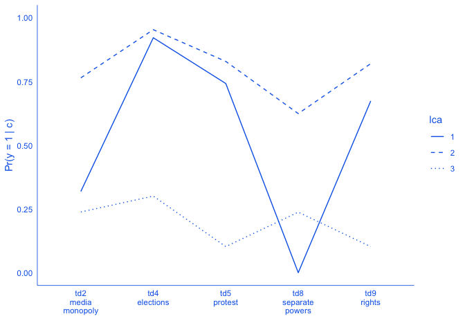
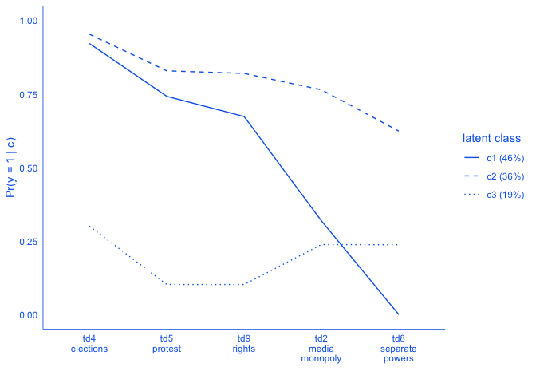
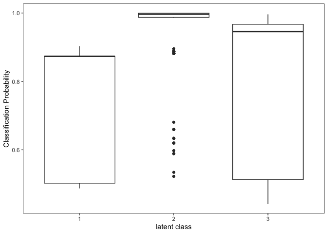
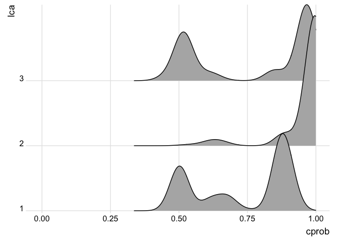

Code 04: gráficos
================
dacarras
Noviembre 23, 2022

# Cargar datos

## Cargar datos desde archivo

``` r
#--------------------------------------------------------------------
# load data
#--------------------------------------------------------------------

#------------------------------------------------
# load main library
#------------------------------------------------

library(dplyr)

#------------------------------------------------
# load data from file
#------------------------------------------------

data_civ <- readRDS('data_civ.rds') # pooled
data_exp <- readRDS('data_exp.rds') # exploratory
data_con <- readRDS('data_con.rds') # confirmatory
```

# Descriptivos

## Items

``` r
#--------------------------------------------------------------------
# item
#--------------------------------------------------------------------

#------------------------------------------------
# item info
#------------------------------------------------

items_table <- read.table(
text="
var_name  variable item_text
IS3G23A   n01      'Voting in every national election'
IS3G23B   n02      'Joining a political party'
IS3G23C   n03      'Learning about the country history'
IS3G23D   n04      'Following political issues in the newspaper, on theradio, on TV or on the Internet'
IS3G23E   n05      'Showing respect for government representatives'
IS3G23F   n06      'Engaging in political discussions'
IS3G23G   n07      'Participating in peaceful protests against laws believed to be unjust'
IS3G23H   n08      'Participating in activities to benefit people in the <local community>'
IS3G23I   n09      'Taking part in activities promoting human rights'
IS3G23J   n10      'Taking part in activities to protect the environment'
IS3G23K   n11      'Working hard'
IS3G23L   n12      'Always obeying the law'
IS3G22A   td1      '[R] Political leaders give government jobs to their family members.'
IS3G22B   td2      '[R] One company or the government owns all newspapers in a country.'
IS3G22C   td3      'People are allowed to publicly criticize the government.'
IS3G22D   td4      'All adult citizens have the right to elect their political leaders.'
IS3G22E   td5      'People are able to protest if they think a law is unfair.'
IS3G22F   td6      '[R] The police have the right to hold people suspected of threatening national security in jail without trial.'
IS3G22G   td7      'Differences in income between poor and rich people are small.'
IS3G22H   td8      '[R] The government influences decisions by courts of justice.'
IS3G22I   td9      'All <ethnic/racial> groups in the country have the same rights.'
",
header=TRUE, stringsAsFactors = FALSE)

# display item table
knitr::kable(items_table)
```

| var_name | variable | item_text                                                                                                        |
|:---------|:---------|:-----------------------------------------------------------------------------------------------------------------|
| IS3G23A  | n01      | Voting in every national election                                                                                |
| IS3G23B  | n02      | Joining a political party                                                                                        |
| IS3G23C  | n03      | Learning about the country history                                                                               |
| IS3G23D  | n04      | Following political issues in the newspaper, on theradio, on TV or on the Internet                               |
| IS3G23E  | n05      | Showing respect for government representatives                                                                   |
| IS3G23F  | n06      | Engaging in political discussions                                                                                |
| IS3G23G  | n07      | Participating in peaceful protests against laws believed to be unjust                                            |
| IS3G23H  | n08      | Participating in activities to benefit people in the <local community>                                           |
| IS3G23I  | n09      | Taking part in activities promoting human rights                                                                 |
| IS3G23J  | n10      | Taking part in activities to protect the environment                                                             |
| IS3G23K  | n11      | Working hard                                                                                                     |
| IS3G23L  | n12      | Always obeying the law                                                                                           |
| IS3G22A  | td1      | \[R\] Political leaders give government jobs to their family members.                                            |
| IS3G22B  | td2      | \[R\] One company or the government owns all newspapers in a country.                                            |
| IS3G22C  | td3      | People are allowed to publicly criticize the government.                                                         |
| IS3G22D  | td4      | All adult citizens have the right to elect their political leaders.                                              |
| IS3G22E  | td5      | People are able to protest if they think a law is unfair.                                                        |
| IS3G22F  | td6      | \[R\] The police have the right to hold people suspected of threatening national security in jail without trial. |
| IS3G22G  | td7      | Differences in income between poor and rich people are small.                                                    |
| IS3G22H  | td8      | \[R\] The government influences decisions by courts of justice.                                                  |
| IS3G22I  | td9      | All <ethnic/racial> groups in the country have the same rights.                                                  |

``` r
#------------------------------------------------
# item selection
#------------------------------------------------

items_selected <- read.table(
text="
var_name  variable item_text
IS3G22D   td4      'All adult citizens have the right to elect their political leaders.'
IS3G22I   td9      'All <ethnic/racial> groups in the country have the same rights.'
IS3G22E   td5      'People are able to protest if they think a law is unfair.'
IS3G22H   td8      '[R] The government influences decisions by courts of justice.'
IS3G22B   td2      '[R] One company or the government owns all newspapers in a country.'
",
header=TRUE, stringsAsFactors = FALSE)

# display item table
knitr::kable(items_selected)
```

| var_name | variable | item_text                                                             |
|:---------|:---------|:----------------------------------------------------------------------|
| IS3G22D  | td4      | All adult citizens have the right to elect their political leaders.   |
| IS3G22I  | td9      | All <ethnic/racial> groups in the country have the same rights.       |
| IS3G22E  | td5      | People are able to protest if they think a law is unfair.             |
| IS3G22H  | td8      | \[R\] The government influences decisions by courts of justice.       |
| IS3G22B  | td2      | \[R\] One company or the government owns all newspapers in a country. |

## Proporciones de respuesta

``` r
#--------------------------------------------------------------------
# load data
#--------------------------------------------------------------------

#------------------------------------------------
# pooled sample
#------------------------------------------------

data_civ %>%
dplyr::select(td4, td9, td5, td8, td2) %>%
ilsa::wide_resp() %>%
knitr::kable(., digits = 2)
```

| variable |   00 |   01 |   NA | hist     |
|:---------|-----:|-----:|-----:|:---------|
| td4      | 0.18 | 0.80 | 0.03 | ▂▁▁▁▁▁▁▇ |
| td9      | 0.37 | 0.60 | 0.03 | ▅▁▁▁▁▁▁▇ |
| td5      | 0.34 | 0.64 | 0.03 | ▅▁▁▁▁▁▁▇ |
| td8      | 0.71 | 0.26 | 0.03 | ▇▁▁▁▁▁▁▃ |
| td2      | 0.52 | 0.45 | 0.03 | ▇▁▁▁▁▁▁▇ |

# Mixture Modelling

## Ajustar modelo de 3 clases

``` r
#------------------------------------------------------------------------------
# lca modelling
#------------------------------------------------------------------------------

# -----------------------------------------------
# class model
# -----------------------------------------------

class_model <- glca::item(td4, td9, td5, td8, td2) ~ 1

# -----------------------------------------------
# number of classes
# -----------------------------------------------

ac3 <- glca::glca(class_model, data = data_civ, nclass = 3, seed = 1, verbose = FALSE)

# -----------------------------------------------
# model fit
# -----------------------------------------------

fit_ac3 <- glca::gofglca(ac3, nboot = 100, test = 'boot', seed = 20221122)

# -----------------------------------------------
# display table
# -----------------------------------------------

fit_ac3$gtable %>%
tibble::as_tibble() %>%
knitr::kable(., digits = 2)
```

| logLik |  AIC | CAIC |  BIC | entropy | Res.Df | Gsq | Boot p-value |
|-------:|-----:|-----:|-----:|--------:|-------:|----:|-------------:|
|  -3883 | 7800 | 7906 | 7889 |    0.61 |     14 |  61 |            0 |

## Resultados

``` r
#------------------------------------------------------------------------------
# results
#------------------------------------------------------------------------------

# -----------------------------------------------
# display results
# -----------------------------------------------

library(glca)
summary(ac3)
```

    ## 
    ## Call:
    ## glca::glca(formula = class_model, data = data_civ, nclass = 3, 
    ##     seed = 1, verbose = FALSE)
    ## 
    ## Manifest items : td4 td9 td5 td8 td2 
    ## 
    ## Categories for manifest items :
    ##     Y = 1 Y = 2
    ## td4     0     1
    ## td9     0     1
    ## td5     0     1
    ## td8     0     1
    ## td2     0     1
    ## 
    ## Model : Latent class analysis 
    ## 
    ## Number of latent classes : 3 
    ## Number of observations : 1377 
    ## Number of parameters : 17 
    ## 
    ## log-likelihood : -3883 
    ##      G-squared : 61 
    ##            AIC : 7800 
    ##            BIC : 7889 
    ## 
    ## Marginal prevalences for latent classes :
    ## Class 1 Class 2 Class 3 
    ##    0.46    0.36    0.19 
    ## 
    ## Class prevalences by group :
    ##     Class 1 Class 2 Class 3
    ## ALL    0.46    0.36    0.19
    ## 
    ## Item-response probabilities (Y = 1) :
    ##           td4  td9  td5  td8  td2
    ## Class 1 0.078 0.33 0.26 1.00 0.68
    ## Class 2 0.047 0.18 0.17 0.38 0.24
    ## Class 3 0.700 0.90 0.90 0.76 0.76
    ## 
    ## Item-response probabilities (Y = 2) :
    ##          td4  td9  td5  td8  td2
    ## Class 1 0.92 0.67 0.74 0.00 0.32
    ## Class 2 0.95 0.82 0.83 0.62 0.76
    ## Class 3 0.30 0.10 0.10 0.24 0.24

# Extrayendo los resultados como tablas

## Prevalencia de las clases

``` r
#------------------------------------------------------------------------------
# lca realizations
#------------------------------------------------------------------------------

# -----------------------------------------------
# display class prevalence
# -----------------------------------------------

ac3 %>%
purrr::pluck('param') %>%
purrr::pluck('gamma') %>%
knitr::kable(., digits = 2)
```

|     | Class 1 | Class 2 | Class 3 |
|:----|--------:|--------:|--------:|
| ALL |    0.46 |    0.36 |    0.19 |

``` r
# -----------------------------------------------
# as steps
# -----------------------------------------------

lca_model <- ac3

class_est <- lca_model$param$gamma
class_err <- lca_model$std.err$gamma
n_class   <- lca_model$model$C
class_names  <- paste0('class_',seq(1:n_class))

class_prev <- data.frame(
  class = class_names,
  e     = as.numeric(class_est),
  se    = as.numeric(class_err)
  )

class_prev %>%
knitr::kable(., digits = 2)
```

| class   |    e |   se |
|:--------|-----:|-----:|
| class_1 | 0.46 | 0.06 |
| class_2 | 0.36 | 0.04 |
| class_3 | 0.19 | 0.05 |

``` r
# -----------------------------------------------
# as a function
# -----------------------------------------------

get_lca_prev <- function(lca){
lca_model     <- lca # object with the fitted data

class_est <- lca_model$param$gamma
class_err <- lca_model$std.err$gamma
n_class   <- lca_model$model$C
class_names  <- paste0('class_',seq(1:n_class))

class_prev <- data.frame(
  class = class_names,
  e     = as.numeric(class_est),
  se    = as.numeric(class_err)
  )

return(class_prev)
}

# -----------------------------------------------
# display result
# -----------------------------------------------

get_lca_prev(ac3) %>%
knitr::kable(., digits = 2)
```

| class   |    e |   se |
|:--------|-----:|-----:|
| class_1 | 0.46 | 0.06 |
| class_2 | 0.36 | 0.04 |
| class_3 | 0.19 | 0.05 |

## Respuestas esperadas

``` r
#------------------------------------------------------------------------------
# lca item estimates
#------------------------------------------------------------------------------

# -----------------------------------------------
# as steps
# -----------------------------------------------

lca_model <- ac3
n_class   <- lca_model$model$C
item      <- 'td4'

lca_model %>%
purrr::pluck('param') %>%
purrr::pluck('rho') %>%
purrr::pluck('ALL') %>%
purrr::pluck(item) %>%
tibble::as_tibble() %>%
rename(cat_1 = 1) %>%
rename(cat_2 = 2) %>%
mutate(class = seq(1:n_class)) %>%
mutate(item = item) %>%
dplyr::select(class, item, cat_1, cat_2) %>%
knitr::kable(., digits = 2)
```

| class | item | cat_1 | cat_2 |
|------:|:-----|------:|------:|
|     1 | td4  |  0.08 |  0.92 |
|     2 | td4  |  0.05 |  0.95 |
|     3 | td4  |  0.70 |  0.30 |

``` r
# -----------------------------------------------
# as a function
# -----------------------------------------------

get_item_resp <- function(lca, item){

lca_model <- lca
n_class   <- lca_model$model$C

lca_model %>%
purrr::pluck('param') %>%
purrr::pluck('rho') %>%
purrr::pluck('ALL') %>%
purrr::pluck(item) %>%
tibble::as_tibble() %>%
rename(cat_1 = 1) %>%
rename(cat_2 = 2) %>%
mutate(class = seq(1:n_class)) %>%
mutate(item = item) %>%
dplyr::select(class, item, cat_1, cat_2)
}

# -----------------------------------------------
# display result
# -----------------------------------------------

get_item_resp(ac3, item = 'td4') %>%
knitr::kable(., digits = 2)
```

| class | item | cat_1 | cat_2 |
|------:|:-----|------:|------:|
|     1 | td4  |  0.08 |  0.92 |
|     2 | td4  |  0.05 |  0.95 |
|     3 | td4  |  0.70 |  0.30 |

## Extraer realizaciones

``` r
#------------------------------------------------------------------------------
# lca realizations
#------------------------------------------------------------------------------

# -----------------------------------------------
# as steps
# -----------------------------------------------

lca_model     <- ac3 # object with the fitted data

lca_posterior <- tibble::as_tibble(lca_model$posterior$ALL)
data_index    <- rownames(as.data.frame(lca_model$datalist$y))
lca_data      <- data.frame(
                 index = as.numeric(data_index), 
                 lca =  factor(apply(lca_posterior, 1, which.max))
                 )

original_names <- names(lca_posterior)
number_of_var  <- length(original_names) 
prob_names     <- paste0('c',seq(1:number_of_var),'_prob')

names(lca_posterior) <- prob_names
dplyr::glimpse(lca_posterior)
```

    ## Rows: 1,377
    ## Columns: 3
    ## $ c1_prob <dbl> 5.0e-01, 2.5e-05, 9.0e-01, 9.0e-01, 9.0e-01, 5.0e-01, 8.7e-01,…
    ## $ c2_prob <dbl> 0.49673, 0.99967, 0.05821, 0.05821, 0.05821, 0.13311, 0.12444,…
    ## $ c3_prob <dbl> 0.0008, 0.0003, 0.0391, 0.0391, 0.0391, 0.3663, 0.0021, 0.5132…

``` r
lca_prob      <- dplyr::bind_cols(
                 data.frame(index = as.numeric(data_index)),
                 lca_posterior
                 )

data_with_lca <- lca_prob %>%
                 mutate(cprob=pmax(!!!rlang::syms(prob_names))) %>%
                 dplyr::left_join(., lca_data, by = 'index') %>%
                 mutate(lca = as.factor(lca)) %>%
                 dplyr::glimpse()
```

    ## Rows: 1,377
    ## Columns: 6
    ## $ index   <dbl> 1, 2, 3, 4, 5, 6, 7, 8, 9, 10, 11, 12, 13, 14, 15, 16, 17, 18,…
    ## $ c1_prob <dbl> 5.0e-01, 2.5e-05, 9.0e-01, 9.0e-01, 9.0e-01, 5.0e-01, 8.7e-01,…
    ## $ c2_prob <dbl> 0.49673, 0.99967, 0.05821, 0.05821, 0.05821, 0.13311, 0.12444,…
    ## $ c3_prob <dbl> 0.0008, 0.0003, 0.0391, 0.0391, 0.0391, 0.3663, 0.0021, 0.5132…
    ## $ cprob   <dbl> 0.50, 1.00, 0.90, 0.90, 0.90, 0.50, 0.87, 0.51, 0.86, 0.87, 0.…
    ## $ lca     <fct> 1, 2, 1, 1, 1, 1, 1, 3, 3, 1, 1, 1, 3, 1, 3, 1, 3, 2, 1, 2, 3,…

``` r
# display 20 cases
data_with_lca[1:20,] %>%
knitr::kable(., digits = 2)
```

| index | c1_prob | c2_prob | c3_prob | cprob | lca |
|------:|--------:|--------:|--------:|------:|:----|
|     1 |    0.50 |    0.50 |    0.00 |  0.50 | 1   |
|     2 |    0.00 |    1.00 |    0.00 |  1.00 | 2   |
|     3 |    0.90 |    0.06 |    0.04 |  0.90 | 1   |
|     4 |    0.90 |    0.06 |    0.04 |  0.90 | 1   |
|     5 |    0.90 |    0.06 |    0.04 |  0.90 | 1   |
|     6 |    0.50 |    0.13 |    0.37 |  0.50 | 1   |
|     7 |    0.87 |    0.12 |    0.00 |  0.87 | 1   |
|     8 |    0.47 |    0.02 |    0.51 |  0.51 | 3   |
|     9 |    0.00 |    0.14 |    0.86 |  0.86 | 3   |
|    10 |    0.87 |    0.07 |    0.05 |  0.87 | 1   |
|    11 |    0.87 |    0.12 |    0.00 |  0.87 | 1   |
|    12 |    0.90 |    0.06 |    0.04 |  0.90 | 1   |
|    13 |    0.03 |    0.00 |    0.97 |  0.97 | 3   |
|    14 |    0.87 |    0.07 |    0.06 |  0.87 | 1   |
|    15 |    0.03 |    0.00 |    0.97 |  0.97 | 3   |
|    16 |    0.87 |    0.12 |    0.00 |  0.87 | 1   |
|    17 |    0.00 |    0.14 |    0.86 |  0.86 | 3   |
|    18 |    0.00 |    0.99 |    0.01 |  0.99 | 2   |
|    19 |    0.50 |    0.50 |    0.00 |  0.50 | 1   |
|    20 |    0.00 |    1.00 |    0.00 |  1.00 | 2   |

``` r
# -----------------------------------------------
# as a function
# -----------------------------------------------

get_lca_realizations <- function(lca){
lca_model     <- lca # object with the fitted data

lca_posterior <- tibble::as_tibble(lca_model$posterior$ALL)
data_index    <- rownames(as.data.frame(lca_model$datalist$y))
lca_data      <- data.frame(
                 index = as.numeric(data_index), 
                 lca =  factor(apply(lca_posterior, 1, which.max))
                 )

original_names <- names(lca_posterior)
number_of_var  <- length(original_names) 
prob_names     <- paste0('c',seq(1:number_of_var),'_prob')

names(lca_posterior) <- prob_names
dplyr::glimpse(lca_posterior)

lca_prob      <- dplyr::bind_cols(
                 data.frame(index = as.numeric(data_index)),
                 lca_posterior
                 )

data_with_lca <- lca_prob %>%
                 mutate(cprob=pmax(!!!rlang::syms(prob_names))) %>%
                 dplyr::left_join(., lca_data, by = 'index') %>%
                 mutate(lca = as.factor(lca)) %>%
                 dplyr::glimpse()

return(data_with_lca)
}

# -----------------------------------------------
# display result
# -----------------------------------------------

# display 20 cases
get_lca_realizations(ac3)[1:20,] %>%
knitr::kable(., digits = 2)
```

    ## Rows: 1,377
    ## Columns: 3
    ## $ c1_prob <dbl> 5.0e-01, 2.5e-05, 9.0e-01, 9.0e-01, 9.0e-01, 5.0e-01, 8.7e-01,…
    ## $ c2_prob <dbl> 0.49673, 0.99967, 0.05821, 0.05821, 0.05821, 0.13311, 0.12444,…
    ## $ c3_prob <dbl> 0.0008, 0.0003, 0.0391, 0.0391, 0.0391, 0.3663, 0.0021, 0.5132…
    ## Rows: 1,377
    ## Columns: 6
    ## $ index   <dbl> 1, 2, 3, 4, 5, 6, 7, 8, 9, 10, 11, 12, 13, 14, 15, 16, 17, 18,…
    ## $ c1_prob <dbl> 5.0e-01, 2.5e-05, 9.0e-01, 9.0e-01, 9.0e-01, 5.0e-01, 8.7e-01,…
    ## $ c2_prob <dbl> 0.49673, 0.99967, 0.05821, 0.05821, 0.05821, 0.13311, 0.12444,…
    ## $ c3_prob <dbl> 0.0008, 0.0003, 0.0391, 0.0391, 0.0391, 0.3663, 0.0021, 0.5132…
    ## $ cprob   <dbl> 0.50, 1.00, 0.90, 0.90, 0.90, 0.50, 0.87, 0.51, 0.86, 0.87, 0.…
    ## $ lca     <fct> 1, 2, 1, 1, 1, 1, 1, 3, 3, 1, 1, 1, 3, 1, 3, 1, 3, 2, 1, 2, 3,…

| index | c1_prob | c2_prob | c3_prob | cprob | lca |
|------:|--------:|--------:|--------:|------:|:----|
|     1 |    0.50 |    0.50 |    0.00 |  0.50 | 1   |
|     2 |    0.00 |    1.00 |    0.00 |  1.00 | 2   |
|     3 |    0.90 |    0.06 |    0.04 |  0.90 | 1   |
|     4 |    0.90 |    0.06 |    0.04 |  0.90 | 1   |
|     5 |    0.90 |    0.06 |    0.04 |  0.90 | 1   |
|     6 |    0.50 |    0.13 |    0.37 |  0.50 | 1   |
|     7 |    0.87 |    0.12 |    0.00 |  0.87 | 1   |
|     8 |    0.47 |    0.02 |    0.51 |  0.51 | 3   |
|     9 |    0.00 |    0.14 |    0.86 |  0.86 | 3   |
|    10 |    0.87 |    0.07 |    0.05 |  0.87 | 1   |
|    11 |    0.87 |    0.12 |    0.00 |  0.87 | 1   |
|    12 |    0.90 |    0.06 |    0.04 |  0.90 | 1   |
|    13 |    0.03 |    0.00 |    0.97 |  0.97 | 3   |
|    14 |    0.87 |    0.07 |    0.06 |  0.87 | 1   |
|    15 |    0.03 |    0.00 |    0.97 |  0.97 | 3   |
|    16 |    0.87 |    0.12 |    0.00 |  0.87 | 1   |
|    17 |    0.00 |    0.14 |    0.86 |  0.86 | 3   |
|    18 |    0.00 |    0.99 |    0.01 |  0.99 | 2   |
|    19 |    0.50 |    0.50 |    0.00 |  0.50 | 1   |
|    20 |    0.00 |    1.00 |    0.00 |  1.00 | 2   |

# Gráficos

## Perfil de respuesta

``` r
#------------------------------------------------------------------------------
# lca response profile
#------------------------------------------------------------------------------

# -----------------------------------------------
# extract expected responses
# -----------------------------------------------

expected_response <- dplyr::bind_rows(
get_item_resp(ac3, item = 'td4'),
get_item_resp(ac3, item = 'td9'),
get_item_resp(ac3, item = 'td5'),
get_item_resp(ac3, item = 'td8'),
get_item_resp(ac3, item = 'td2')
)


# -----------------------------------------------
# response profile plot
# -----------------------------------------------

library(ggplot2)
expected_response %>%
mutate(lca = as.factor(class)) %>%
mutate(item_text = case_when(
  item == 'td4' ~ 'td4\nelections',
  item == 'td9' ~ 'td9\nrights',
  item == 'td5' ~ 'td5\nprotest',
  item == 'td8' ~ 'td8\nseparate\npowers',
  item == 'td2' ~ 'td2\nmedia\nmonopoly'
  )) %>%
ggplot(data=., aes(x=item_text, y=cat_2, group=lca)) +
  geom_line(aes(linetype=lca, colour = lca)) +
  ylim(0,1) +
  ylab('Pr(y = 1 | c)') +
  xlab('') +
  theme_minimal() +  
  theme(
    text = element_text(colour = "#1068E9"),
    axis.text.y = element_text(colour = "#1068E9"),
    axis.text.x = element_text(colour = "#1068E9"),
    axis.line = element_line(colour = "#1068E9", size = .3),
    panel.grid.major = element_blank(),
    panel.grid.minor = element_blank(),
    panel.border = element_blank(),
    panel.background = element_blank()
    ) +
  scale_color_manual(values= c('#1068E9','#1068E9','#1068E9')) +
  scale_linetype_manual(values= c('solid','dashed','dotted'))
```

<!-- -->

``` r
# -----------------------------------------------
# response profile plot (reordering items)
# -----------------------------------------------

library(ggplot2)
expected_response %>%
mutate(lca = as.factor(class)) %>%
mutate(item_text = case_when(
  item == 'td4' ~ 'td4\nelections',
  item == 'td9' ~ 'td9\nrights',
  item == 'td5' ~ 'td5\nprotest',
  item == 'td8' ~ 'td8\nseparate\npowers',
  item == 'td2' ~ 'td2\nmedia\nmonopoly'
  )) %>%
mutate(item_fct = forcats::fct_relevel(item_text, 
'td4\nelections',
'td5\nprotest',
'td9\nrights',
'td2\nmedia\nmonopoly',
'td8\nseparate\npowers'
)) %>%
mutate(lca_text = case_when(
class == 1 ~ 'c1 (46%)',
class == 2 ~ 'c2 (36%)',
class == 3 ~ 'c3 (19%)'
)) %>%
ggplot(data=., aes(x=item_fct, y=cat_2, group=lca_text)) +
  geom_line(aes(linetype=lca_text, colour = lca_text)) +
  ylim(0,1) +
  ylab('Pr(y = 1 | c)') +
  xlab('') +
  theme_minimal() +  
  theme(
    text = element_text(colour = "#1068E9"),
    axis.text.y = element_text(colour = "#1068E9"),
    axis.text.x = element_text(colour = "#1068E9"),
    axis.line = element_line(colour = "#1068E9", size = .3),
    panel.grid.major = element_blank(),
    panel.grid.minor = element_blank(),
    panel.border = element_blank(),
    panel.background = element_blank()
    ) +  
  scale_color_manual(values= c('#1068E9','#1068E9','#1068E9')) +
  scale_linetype_manual(values= c('solid','dashed','dotted')) +
  labs(
    color    = 'latent class',
    linetype = 'latent class'
    )
```

<!-- -->

## Error de classificación

``` r
#------------------------------------------------------------------------------
# classification probabilities
#------------------------------------------------------------------------------

# -----------------------------------------------
# boxplot
# -----------------------------------------------

get_lca_realizations(ac3) %>%
ggplot(., aes(x=lca, y=cprob)) + 
geom_boxplot() +
  theme_bw() +  
  theme(
    panel.grid.major = element_blank(),
    panel.grid.minor = element_blank(),
    panel.background = element_blank()
    ) +
  labs(
    y = 'Classification Probability',
    x = 'latent class')
```

    ## Rows: 1,377
    ## Columns: 3
    ## $ c1_prob <dbl> 5.0e-01, 2.5e-05, 9.0e-01, 9.0e-01, 9.0e-01, 5.0e-01, 8.7e-01,…
    ## $ c2_prob <dbl> 0.49673, 0.99967, 0.05821, 0.05821, 0.05821, 0.13311, 0.12444,…
    ## $ c3_prob <dbl> 0.0008, 0.0003, 0.0391, 0.0391, 0.0391, 0.3663, 0.0021, 0.5132…
    ## Rows: 1,377
    ## Columns: 6
    ## $ index   <dbl> 1, 2, 3, 4, 5, 6, 7, 8, 9, 10, 11, 12, 13, 14, 15, 16, 17, 18,…
    ## $ c1_prob <dbl> 5.0e-01, 2.5e-05, 9.0e-01, 9.0e-01, 9.0e-01, 5.0e-01, 8.7e-01,…
    ## $ c2_prob <dbl> 0.49673, 0.99967, 0.05821, 0.05821, 0.05821, 0.13311, 0.12444,…
    ## $ c3_prob <dbl> 0.0008, 0.0003, 0.0391, 0.0391, 0.0391, 0.3663, 0.0021, 0.5132…
    ## $ cprob   <dbl> 0.50, 1.00, 0.90, 0.90, 0.90, 0.50, 0.87, 0.51, 0.86, 0.87, 0.…
    ## $ lca     <fct> 1, 2, 1, 1, 1, 1, 1, 3, 3, 1, 1, 1, 3, 1, 3, 1, 3, 2, 1, 2, 3,…

<!-- -->

``` r
# -----------------------------------------------
# overlay density histograms
# -----------------------------------------------

library(ggplot2)
library(ggridges)

get_lca_realizations(ac3) %>%
ggplot(., aes(x = cprob, y = lca)) +
  geom_density_ridges(scale = 2) + 
  scale_y_discrete(expand = c(0, 0)) +     # will generally have to set the `expand` option
  scale_x_continuous(expand = c(0, 0)) +   # for both axes to remove unneeded padding
  coord_cartesian(clip = "off") + # to avoid clipping of the very top of the top ridgeline
  theme_ridges() +
  xlim(0,1)
```

    ## Rows: 1,377
    ## Columns: 3
    ## $ c1_prob <dbl> 5.0e-01, 2.5e-05, 9.0e-01, 9.0e-01, 9.0e-01, 5.0e-01, 8.7e-01,…
    ## $ c2_prob <dbl> 0.49673, 0.99967, 0.05821, 0.05821, 0.05821, 0.13311, 0.12444,…
    ## $ c3_prob <dbl> 0.0008, 0.0003, 0.0391, 0.0391, 0.0391, 0.3663, 0.0021, 0.5132…
    ## Rows: 1,377
    ## Columns: 6
    ## $ index   <dbl> 1, 2, 3, 4, 5, 6, 7, 8, 9, 10, 11, 12, 13, 14, 15, 16, 17, 18,…
    ## $ c1_prob <dbl> 5.0e-01, 2.5e-05, 9.0e-01, 9.0e-01, 9.0e-01, 5.0e-01, 8.7e-01,…
    ## $ c2_prob <dbl> 0.49673, 0.99967, 0.05821, 0.05821, 0.05821, 0.13311, 0.12444,…
    ## $ c3_prob <dbl> 0.0008, 0.0003, 0.0391, 0.0391, 0.0391, 0.3663, 0.0021, 0.5132…
    ## $ cprob   <dbl> 0.50, 1.00, 0.90, 0.90, 0.90, 0.50, 0.87, 0.51, 0.86, 0.87, 0.…
    ## $ lca     <fct> 1, 2, 1, 1, 1, 1, 1, 3, 3, 1, 1, 1, 3, 1, 3, 1, 3, 2, 1, 2, 3,…

    ## Scale for x is already present.
    ## Adding another scale for x, which will replace the existing scale.
    ## Picking joint bandwidth of 0.035

<!-- -->
