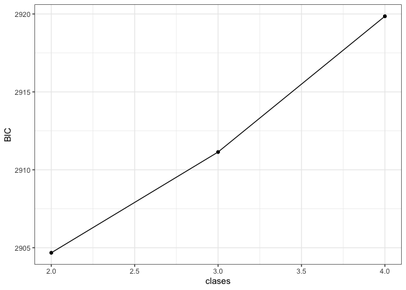
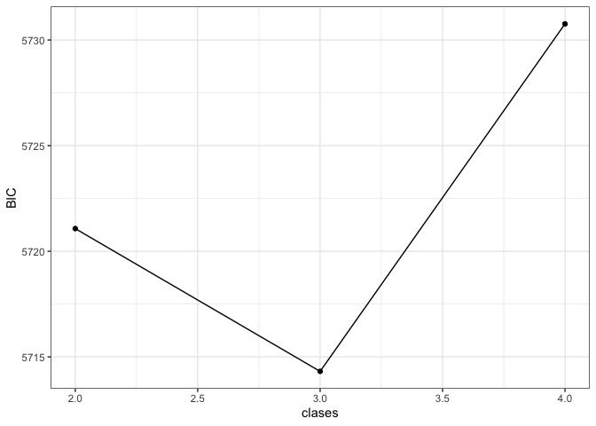
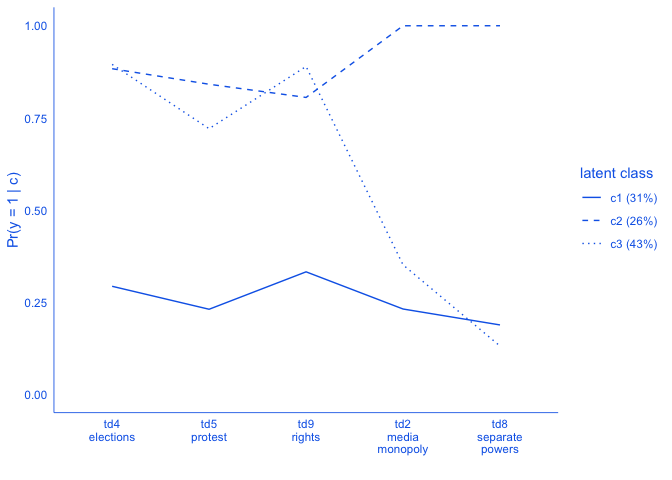
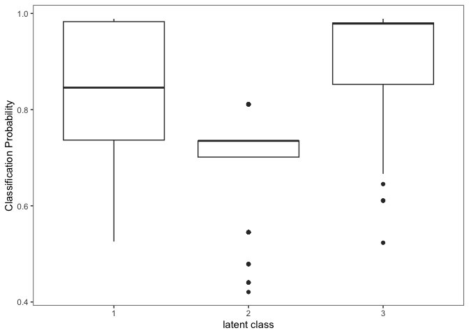
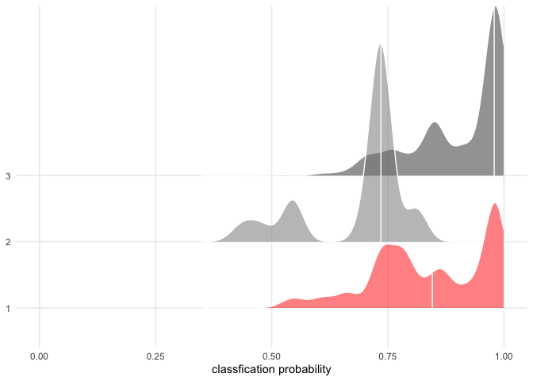
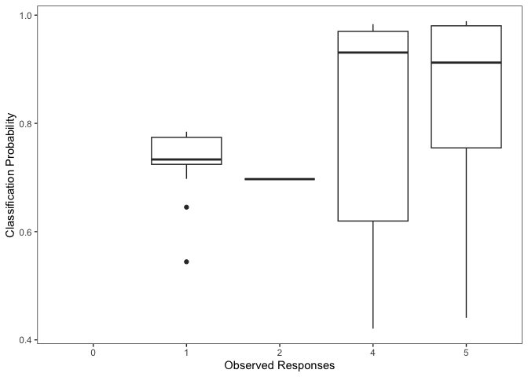
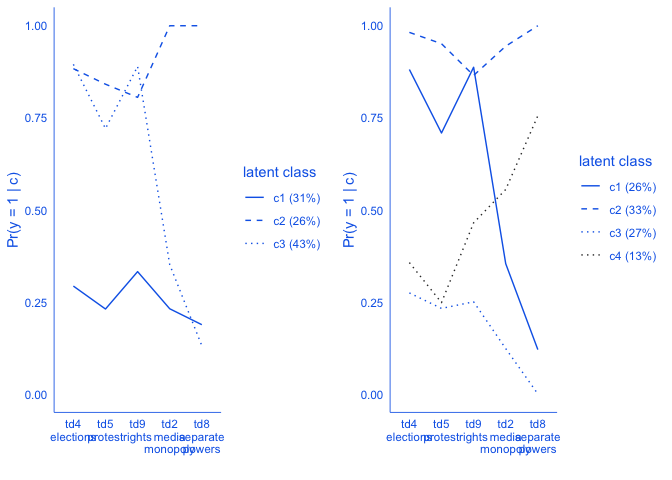
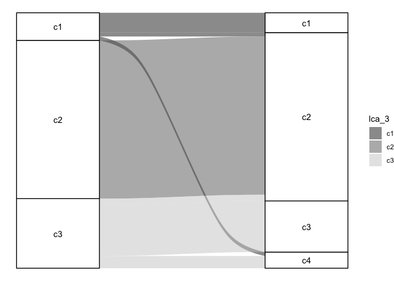

Code 06: ejercicio resuelto
================
dacarras
Noviembre 23, 2022

# Notas sobre el ejercicio resuelto

- Las soluciones incluidas siguen la idea de “opinionated data analysis”
  (Parker, 2017). Estas consisten en soluciones razonables, y no la
  única forma de resolver los ejercicios.

# Ejercicio

- Prepare los datos
  - filtre los casos de Mexico
  - genere una muestra de calibracion (exploratoria) de 500 casos
  - genere una muestra de confirmatoria de 500 casos
  - genere una muestra total de casos
  - seleccione los mismos items empleados en los ejemplos anterioes

<!-- -->


    #------------------------------------------------
    # item selection
    #------------------------------------------------

    items_selected <- read.table(
    text="
    var_name  variable item_text
    IS3G22D   td4      'All adult citizens have the right to elect their political leaders.'
    IS3G22I   td9      'All <ethnic/racial> groups in the country have the same rights.'
    IS3G22E   td5      'People are able to protest if they think a law is unfair.'
    IS3G22H   td8      '[R] The government influences decisions by courts of justice.'
    IS3G22B   td2      '[R] One company or the government owns all newspapers in a country.'
    ",
    header=TRUE, stringsAsFactors = FALSE)

    # display item table
    knitr::kable(items_selected)

- Numero de clases
  - ajuste 2-4 clases sobre la muestra exploratoria
  - ajuste 2-4 clases sobre la muestra confirmatoria
  - decida el numero de clases
- Resultados
  - Ajuste un modelo de 3 clases sobre la muestra total
  - Genere un gráfico de perfil de respuesta
  - Genere un gráfico de error de clasificación
- Bonus
  - Compare como se ven los errores de clasificación según la cantidad
    de observaciones con respuestas válidas.
    - ¿Que le pasa al error de clasificación según la cantidad de
      respuestas observadas?
  - Compare un modelo de 3 y 4 clases.
    - Ajuste ambos modelos
    - Agregue las realizaciones sobre la base de datos de respuestas
    - Genere una tabla cruzada de las realizaciones producidas
    - ¿Tiene sentido agregar una clase adicional?

# Preparación de datos

## Datos de Mexico

``` r
#--------------------------------------------------------------------
# prepare data for modelling
#--------------------------------------------------------------------

#------------------------------------------------
# country table
#------------------------------------------------

country_table <- read.table(
text="
COUNTRY  IDCNTRY   ctry_name
BFL      956       'Belgium (Flemish)'
BGR      100       'Bulgaria'
CHL      152       'Chile'
COL      170       'Colombia'
DNK      208       'Denmark'
DNW      276001    'North Rhine-Westphalia'
DOM      214       'Dominican Republic'
EST      233       'Estonia'
FIN      246       'Finland'
HKG      344       'Hong Kong, SAR China'
HRV      191       'Croatia'
ITA      380       'Italy'
KOR      410       'Korea (South)'
LTU      440       'Lithuania'
LVA      428       'Latvia'
MEX      484       'Mexico'
MLT      470       'Malta'
NLD      528       'Netherlands'
NOR      578       'Norway'
PER      604       'Peru'
RUS      643       'Russian Federation'
SVN      705       'Slovenia'
SWE      752       'Sweden'
TWN      158       'Taiwan, Republic of China'
",
header=TRUE, stringsAsFactors = FALSE)
knitr::kable(country_table)
```

| COUNTRY | IDCNTRY | ctry_name                 |
|:--------|--------:|:--------------------------|
| BFL     |     956 | Belgium (Flemish)         |
| BGR     |     100 | Bulgaria                  |
| CHL     |     152 | Chile                     |
| COL     |     170 | Colombia                  |
| DNK     |     208 | Denmark                   |
| DNW     |  276001 | North Rhine-Westphalia    |
| DOM     |     214 | Dominican Republic        |
| EST     |     233 | Estonia                   |
| FIN     |     246 | Finland                   |
| HKG     |     344 | Hong Kong, SAR China      |
| HRV     |     191 | Croatia                   |
| ITA     |     380 | Italy                     |
| KOR     |     410 | Korea (South)             |
| LTU     |     440 | Lithuania                 |
| LVA     |     428 | Latvia                    |
| MEX     |     484 | Mexico                    |
| MLT     |     470 | Malta                     |
| NLD     |     528 | Netherlands               |
| NOR     |     578 | Norway                    |
| PER     |     604 | Peru                      |
| RUS     |     643 | Russian Federation        |
| SVN     |     705 | Slovenia                  |
| SWE     |     752 | Sweden                    |
| TWN     |     158 | Taiwan, Republic of China |

``` r
# -----------------------------------------------
# recode functions
# -----------------------------------------------

rec_1 <- function(x){
dplyr::case_when(
#  variable == old ~ new
  x == 1 ~ 1,
  x == 2 ~ 1,
  x == 3 ~ 0,
  x == 4 ~ 0,   
  TRUE ~ as.numeric(x))
# Note: it recodes likert type items,
#       where 1 is very important (1) and quite important (2)
#       and zero is not very important (3) and not important at all (4)
}

rec_2 <- function(x){
dplyr::case_when(
  x == 1 ~ 1, # good for democracy
  x == 2 ~ 0, # neither good or bad for democracy
  x == 3 ~ 0, # bad for democracy
  TRUE ~ as.numeric(x))
}

rec_3 <- function(x){
dplyr::case_when(
  x == 1 ~ 0, # good for democracy
  x == 2 ~ 0, # neither good or bad for democracy
  x == 3 ~ 1, # bad for democracy
  TRUE ~ as.numeric(x))
}


#------------------------------------------------
# preprare data
#------------------------------------------------

library(dplyr)
```

    ## 
    ## Attaching package: 'dplyr'

    ## The following objects are masked from 'package:stats':
    ## 
    ##     filter, lag

    ## The following objects are masked from 'package:base':
    ## 
    ##     intersect, setdiff, setequal, union

``` r
data_mex   <- ilsa::iccs_2016 %>%
              # remove labels
              ilsa::remove_labels() %>%
              # clustering
              mutate(id_i = seq(1:nrow(.))) %>%
              mutate(id_j = as.numeric(as.factor(paste0(COUNTRY, JKZONES, IDSCHOOL)))) %>%
              mutate(id_s = as.numeric(as.factor(paste0(COUNTRY, JKZONES)))) %>%
              mutate(id_r = as.numeric(as.factor(paste0(COUNTRY, JKZONES, JKREPS)))) %>%
              mutate(id_k = as.numeric(as.factor(paste0(COUNTRY)))) %>%
              # survey weights
              mutate(wt = TOTWGTS) %>%
              # students weights
              mutate(wi = WGTFAC2S*WGTADJ2S*WGTADJ3S) %>%
              # school weights
              mutate(wj = WGTFAC1*WGTADJ1S) %>%
              # create senate weights
              ilsa::senate_weights(., wt = 'wt', id_k = 'id_k', scale = 1000) %>%
              # create scaled weights
              ilsa::lsa_weights(., 
                id_i = 'id_i', 
                id_j = 'id_j', 
                id_k = 'id_k', 
                wt = 'wt', 
                wi = 'wi', 
                wj = 'wj') %>%
              # add country names
              dplyr::left_join(., 
                dplyr::select(country_table, COUNTRY, ctry_name), 
                by = 'COUNTRY') %>%
              # prepare data items
              ## citizenship norms
              mutate(n01 = rec_1(IS3G23A)) %>% 
              mutate(n02 = rec_1(IS3G23B)) %>% 
              mutate(n03 = rec_1(IS3G23C)) %>% 
              mutate(n04 = rec_1(IS3G23D)) %>% 
              mutate(n05 = rec_1(IS3G23E)) %>% 
              mutate(n06 = rec_1(IS3G23F)) %>% 
              mutate(n07 = rec_1(IS3G23G)) %>% 
              mutate(n08 = rec_1(IS3G23H)) %>% 
              mutate(n09 = rec_1(IS3G23I)) %>% 
              mutate(n10 = rec_1(IS3G23J)) %>% 
              mutate(n11 = rec_1(IS3G23K)) %>% 
              mutate(n12 = rec_1(IS3G23L)) %>% 
              ## concept of democracy
              mutate(td1 = rec_3(IS3G22A)) %>%
              mutate(td2 = rec_3(IS3G22B)) %>%
              mutate(td3 = rec_2(IS3G22C)) %>%
              mutate(td4 = rec_2(IS3G22D)) %>%
              mutate(td5 = rec_2(IS3G22E)) %>%
              mutate(td6 = rec_3(IS3G22F)) %>%
              mutate(td7 = rec_2(IS3G22G)) %>%
              mutate(td8 = rec_3(IS3G22H)) %>%
              mutate(td9 = rec_2(IS3G22I)) %>%
              # filter mexican data
              dplyr::filter(ctry_name == 'Mexico') %>%
              # keep data for modelling
              dplyr::select(id_i, id_j, ws, ctry_name, td4, td9, td5, td8, td2) %>%
              dplyr::glimpse()
```

    ## Rows: 5,526
    ## Columns: 9
    ## $ id_i      <int> 53715, 53716, 53717, 53718, 53719, 53720, 53721, 53722, 5372…
    ## $ id_j      <dbl> 3007, 3027, 3027, 3027, 3027, 3027, 3027, 3027, 3027, 3027, …
    ## $ ws        <dbl> 0.0054, 0.1322, 0.1322, 0.1322, 0.1322, 0.1322, 0.1322, 0.13…
    ## $ ctry_name <chr> "Mexico", "Mexico", "Mexico", "Mexico", "Mexico", "Mexico", …
    ## $ td4       <dbl> 1, 1, 1, 1, 1, 1, 1, 1, 1, 1, 1, 1, 1, 1, 1, 1, 1, 1, 1, 0, …
    ## $ td9       <dbl> 1, 1, 1, 1, 1, 1, 1, 1, 1, 1, 0, 1, 0, 1, 1, 1, 1, 1, 0, 1, …
    ## $ td5       <dbl> 1, 1, 1, 0, 1, 0, 1, 1, 1, 1, 0, 0, 0, 1, 0, 1, 1, 0, 1, 0, …
    ## $ td8       <dbl> 0, 1, 1, 1, 1, 0, 0, 0, 0, 0, 0, 0, 0, 0, 0, 0, 1, 0, 0, 0, …
    ## $ td2       <dbl> 0, 1, 0, 1, 1, 1, 0, 1, 0, 1, 0, 0, 0, 0, 0, 0, 0, 0, 0, 0, …

## Datos de calibración

``` r
#--------------------------------------------------------------------
# calibration data
#--------------------------------------------------------------------

#------------------------------------------------
# define random seed
#------------------------------------------------

set.seed(123)

#------------------------------------------------
# select 1000 random cases within contry
#------------------------------------------------

sel1k  <- data_mex %>%
          sample_n(1000, weights = ws, replace = FALSE) %>%     
          mutate(sel_1k = 1) %>%
          dplyr::select(id_i, sel_1k)

#------------------------------------------------
# select 500 for exploration, within previous
#------------------------------------------------

sub_exp <- data_mex %>%
           dplyr::left_join(., sel1k, by = 'id_i') %>%
           dplyr::filter(sel_1k == 1) %>%
           sample_n(500, weights = ws, replace = FALSE) %>%     
           mutate(sel_exp = 1) %>%
           
           dplyr::select(id_i, sel_exp)

#------------------------------------------------
# select 500 for exploration, within previous
#------------------------------------------------

sub_con <- data_mex %>%
           dplyr::left_join(., sel1k, by = 'id_i') %>%
           dplyr::filter(sel_1k == 1) %>%
           dplyr::left_join(., sub_exp, by = 'id_i') %>%
           mutate(sel_exp = tidyr::replace_na(sel_exp, 0)) %>%
           mutate(sel_con = case_when(
            sel_exp == 1 ~ 0,
            sel_exp == 0 ~ 1
            )) %>%
           dplyr::select(id_i, sel_exp, sel_con)

#------------------------------------------------
# add data flags
#------------------------------------------------

data_all <- data_mex %>%
            dplyr::left_join(., sel1k, by = 'id_i') %>%
            dplyr::left_join(., sub_con, by = 'id_i') %>%
            dplyr::glimpse()
```

    ## Rows: 5,526
    ## Columns: 12
    ## $ id_i      <int> 53715, 53716, 53717, 53718, 53719, 53720, 53721, 53722, 5372…
    ## $ id_j      <dbl> 3007, 3027, 3027, 3027, 3027, 3027, 3027, 3027, 3027, 3027, …
    ## $ ws        <dbl> 0.0054, 0.1322, 0.1322, 0.1322, 0.1322, 0.1322, 0.1322, 0.13…
    ## $ ctry_name <chr> "Mexico", "Mexico", "Mexico", "Mexico", "Mexico", "Mexico", …
    ## $ td4       <dbl> 1, 1, 1, 1, 1, 1, 1, 1, 1, 1, 1, 1, 1, 1, 1, 1, 1, 1, 1, 0, …
    ## $ td9       <dbl> 1, 1, 1, 1, 1, 1, 1, 1, 1, 1, 0, 1, 0, 1, 1, 1, 1, 1, 0, 1, …
    ## $ td5       <dbl> 1, 1, 1, 0, 1, 0, 1, 1, 1, 1, 0, 0, 0, 1, 0, 1, 1, 0, 1, 0, …
    ## $ td8       <dbl> 0, 1, 1, 1, 1, 0, 0, 0, 0, 0, 0, 0, 0, 0, 0, 0, 1, 0, 0, 0, …
    ## $ td2       <dbl> 0, 1, 0, 1, 1, 1, 0, 1, 0, 1, 0, 0, 0, 0, 0, 0, 0, 0, 0, 0, …
    ## $ sel_1k    <dbl> 1, NA, NA, NA, NA, NA, NA, NA, NA, NA, NA, NA, NA, NA, NA, N…
    ## $ sel_exp   <dbl> 0, NA, NA, NA, NA, NA, NA, NA, NA, NA, NA, NA, NA, NA, NA, N…
    ## $ sel_con   <dbl> 1, NA, NA, NA, NA, NA, NA, NA, NA, NA, NA, NA, NA, NA, NA, N…

``` r
#------------------------------------------------
# display table of selecion
#------------------------------------------------

dplyr::count(data_all, sel_1k, sel_exp, sel_con) %>%
knitr::kable()
```

| sel_1k | sel_exp | sel_con |    n |
|-------:|--------:|--------:|-----:|
|      1 |       0 |       1 |  500 |
|      1 |       1 |       0 |  500 |
|        |         |         | 4526 |

``` r
#------------------------------------------------
# data for modelling
#------------------------------------------------

data_mod <- dplyr::filter(data_all, sel_1k == 1)
data_exp <- dplyr::filter(data_all, sel_exp == 1)
data_con <- dplyr::filter(data_all, sel_con == 1)
```

# Número de clases

## Ecuación

``` r
#------------------------------------------------------------------------------
# lca modelling
#------------------------------------------------------------------------------

# -----------------------------------------------
# class model
# -----------------------------------------------

class_model <- glca::item(td4, td9, td5, td8, td2) ~ 1
```

## Número de clases (exploratory)

``` r
#------------------------------------------------------------------------------
# lca modelling
#------------------------------------------------------------------------------

# -----------------------------------------------
# number of classes
# -----------------------------------------------

ec2 <- glca::glca(class_model, data = data_exp, nclass = 2, seed = 1, verbose = FALSE)
ec3 <- glca::glca(class_model, data = data_exp, nclass = 3, seed = 1, verbose = FALSE)
ec4 <- glca::glca(class_model, data = data_exp, nclass = 4, seed = 1, verbose = FALSE)

# -----------------------------------------------
# model comparison
# -----------------------------------------------

fit_exp <- glca::gofglca(ec2, ec3, ec4, nboot = 100, test = 'boot', seed = 20221122)

# -----------------------------------------------
# fit table
# -----------------------------------------------

fit_table_exp <- fit_exp$gtable %>%
                 tibble::as_tibble() %>%
                 mutate(clases = c(2,3,4)) %>%
                 mutate(SIC = -.5*BIC) %>% 
                 mutate(cmP = exp(SIC-max(SIC))/sum(exp(SIC-max(SIC)))) %>%
                 mutate(BF = exp(SIC - dplyr::lead(SIC)))

# -----------------------------------------------
# display table
# -----------------------------------------------

fit_table_exp %>%
knitr::kable(., digits = 2)
```

| logLik |  AIC | CAIC |  BIC | entropy | Res.Df | Gsq | Boot p-value | clases |   SIC | cmP |      BF |
|-------:|-----:|-----:|-----:|--------:|-------:|----:|-------------:|-------:|------:|----:|--------:|
|  -1399 | 2821 | 2878 | 2867 |    0.54 |     20 |  42 |         0.00 |      2 | -1433 |   1 |    7329 |
|  -1390 | 2813 | 2902 | 2885 |    0.68 |     14 |  23 |         0.30 |      3 | -1442 |   0 | 4395830 |
|  -1386 | 2819 | 2938 | 2915 |    0.77 |      8 |  16 |         0.45 |      4 | -1458 |   0 |         |

``` r
# -----------------------------------------------
# scree plot
# -----------------------------------------------

library(ggplot2)
fit_table_exp %>%
mutate(grp = 'model') %>%
ggplot(., 
  aes(x = clases, y = BIC, group = grp)) +
  geom_point() +
  geom_line() +
  theme_bw()
```

<!-- -->

## Número de clases (confirmatory)

``` r
#------------------------------------------------------------------------------
# lca modelling
#------------------------------------------------------------------------------

# -----------------------------------------------
# number of classes
# -----------------------------------------------

cc2 <- glca::glca(class_model, data = data_con, nclass = 2, seed = 1, verbose = FALSE)
cc3 <- glca::glca(class_model, data = data_con, nclass = 3, seed = 1, verbose = FALSE)
cc4 <- glca::glca(class_model, data = data_con, nclass = 4, seed = 1, verbose = FALSE)

# -----------------------------------------------
# model comparison
# -----------------------------------------------

fit_con <- glca::gofglca(cc2, cc3, cc4, nboot = 100, test = 'boot', seed = 20221122)

# -----------------------------------------------
# fit table
# -----------------------------------------------

fit_table_con <- fit_con$gtable %>%
                 tibble::as_tibble() %>%
                 mutate(clases = c(2,3,4)) %>%
                 mutate(SIC = -.5*BIC) %>% 
                 mutate(cmP = exp(SIC-max(SIC))/sum(exp(SIC-max(SIC)))) %>%
                 mutate(BF = exp(SIC - dplyr::lead(SIC)))

# -----------------------------------------------
# display table
# -----------------------------------------------

fit_table_con %>%
knitr::kable(., digits = 2)
```

| logLik |  AIC | CAIC |  BIC | entropy | Res.Df | Gsq | Boot p-value | clases |   SIC |  cmP |  BF |
|-------:|-----:|-----:|-----:|--------:|-------:|----:|-------------:|-------:|------:|-----:|----:|
|  -1418 | 2859 | 2916 | 2905 |    0.66 |     20 |  74 |         0.00 |      2 | -1452 | 0.96 |  25 |
|  -1403 | 2840 | 2928 | 2911 |    0.62 |     14 |  43 |         0.00 |      3 | -1456 | 0.04 |  78 |
|  -1389 | 2823 | 2943 | 2920 |    0.76 |      8 |  15 |         0.56 |      4 | -1460 | 0.00 |     |

``` r
# -----------------------------------------------
# scree plot
# -----------------------------------------------

library(ggplot2)
fit_table_con %>%
mutate(grp = 'model') %>%
ggplot(., 
  aes(x = clases, y = BIC, group = grp)) +
  geom_point() +
  geom_line() +
  theme_bw()
```

<!-- -->

## Número de clases (pooled)

``` r
#------------------------------------------------------------------------------
# lca modelling
#------------------------------------------------------------------------------

# -----------------------------------------------
# number of classes
# -----------------------------------------------

ac2 <- glca::glca(class_model, data = data_mod, nclass = 2, seed = 1, verbose = FALSE)
ac3 <- glca::glca(class_model, data = data_mod, nclass = 3, seed = 1, verbose = FALSE)
ac4 <- glca::glca(class_model, data = data_mod, nclass = 4, seed = 1, verbose = FALSE)

# -----------------------------------------------
# model comparison
# -----------------------------------------------

fit_all <- glca::gofglca(ac2, ac3, ac4, nboot = 100, test = 'boot', seed = 20221122)

# -----------------------------------------------
# fit table
# -----------------------------------------------

fit_table_all <- fit_all$gtable %>%
                 tibble::as_tibble() %>%
                 mutate(clases = c(2,3,4)) %>%
                 mutate(SIC = -.5*BIC) %>% 
                 mutate(cmP = exp(SIC-max(SIC))/sum(exp(SIC-max(SIC)))) %>%
                 mutate(BF = exp(SIC - dplyr::lead(SIC)))

# -----------------------------------------------
# display table
# -----------------------------------------------

fit_table_all %>%
knitr::kable(., digits = 2)
```

| logLik |  AIC | CAIC |  BIC | entropy | Res.Df | Gsq | Boot p-value | clases |   SIC |  cmP |      BF |
|-------:|-----:|-----:|-----:|--------:|-------:|----:|-------------:|-------:|------:|-----:|--------:|
|  -2823 | 5667 | 5732 | 5721 |    0.59 |     20 |  94 |         0.00 |      2 | -2861 | 0.03 |    0.03 |
|  -2799 | 5631 | 5731 | 5714 |    0.69 |     14 |  46 |         0.00 |      3 | -2857 | 0.97 | 3737.39 |
|  -2786 | 5618 | 5754 | 5731 |    0.71 |      8 |  21 |         0.22 |      4 | -2865 | 0.00 |         |

``` r
# -----------------------------------------------
# scree plot
# -----------------------------------------------

library(ggplot2)
fit_table_all %>%
mutate(grp = 'model') %>%
ggplot(., 
  aes(x = clases, y = BIC, group = grp)) +
  geom_point() +
  geom_line() +
  theme_bw()
```

<!-- -->

# Resultados

## Ajustar modelo de 3 clases

``` r
#------------------------------------------------------------------------------
# lca modelling
#------------------------------------------------------------------------------

# -----------------------------------------------
# class model
# -----------------------------------------------

class_model <- glca::item(td4, td9, td5, td8, td2) ~ 1

# -----------------------------------------------
# number of classes
# -----------------------------------------------

ac3 <- glca::glca(class_model, data = data_mod, nclass = 3, seed = 1, verbose = FALSE)

# -----------------------------------------------
# model fit
# -----------------------------------------------

fit_ac3 <- glca::gofglca(ac3, nboot = 100, test = 'boot', seed = 20221122)

# -----------------------------------------------
# display table
# -----------------------------------------------

fit_ac3$gtable %>%
tibble::as_tibble() %>%
knitr::kable(., digits = 2)
```

| logLik |  AIC | CAIC |  BIC | entropy | Res.Df | Gsq | Boot p-value |
|-------:|-----:|-----:|-----:|--------:|-------:|----:|-------------:|
|  -2799 | 5631 | 5731 | 5714 |    0.69 |     14 |  46 |            0 |

## Resultados

``` r
#------------------------------------------------------------------------------
# results
#------------------------------------------------------------------------------

# -----------------------------------------------
# display results
# -----------------------------------------------

library(glca)
summary(ac3)
```

    ## 
    ## Call:
    ## glca::glca(formula = class_model, data = data_mod, nclass = 3, 
    ##     seed = 1, verbose = FALSE)
    ## 
    ## Manifest items : td4 td9 td5 td8 td2 
    ## 
    ## Categories for manifest items :
    ##     Y = 1 Y = 2
    ## td4     0     1
    ## td9     0     1
    ## td5     0     1
    ## td8     0     1
    ## td2     0     1
    ## 
    ## Model : Latent class analysis 
    ## 
    ## Number of latent classes : 3 
    ## Number of observations : 980 
    ## Number of parameters : 17 
    ## 
    ## log-likelihood : -2799 
    ##      G-squared : 46 
    ##            AIC : 5631 
    ##            BIC : 5714 
    ## 
    ## Marginal prevalences for latent classes :
    ## Class 1 Class 2 Class 3 
    ##   0.292   0.078   0.629 
    ## 
    ## Class prevalences by group :
    ##     Class 1 Class 2 Class 3
    ## ALL    0.29   0.078    0.63
    ## 
    ## Item-response probabilities (Y = 1) :
    ##          td4  td9  td5  td8  td2
    ## Class 1 0.71 0.67 0.77 0.81 0.77
    ## Class 2 0.12 0.20 0.16 0.00 0.00
    ## Class 3 0.10 0.11 0.28 0.87 0.65
    ## 
    ## Item-response probabilities (Y = 2) :
    ##          td4  td9  td5  td8  td2
    ## Class 1 0.29 0.33 0.23 0.19 0.23
    ## Class 2 0.88 0.81 0.84 1.00 1.00
    ## Class 3 0.90 0.89 0.72 0.13 0.35

# Perfil de respuesta

## Prevalencia de las clases

``` r
#------------------------------------------------------------------------------
# lca realizations
#------------------------------------------------------------------------------

# -----------------------------------------------
# retrieve class prevalence
# -----------------------------------------------

get_lca_prev <- function(lca){
lca_model     <- lca # object with the fitted data

class_est <- lca_model$param$gamma
class_err <- lca_model$std.err$gamma
n_class   <- lca_model$model$C
class_names  <- paste0('class_',seq(1:n_class))

class_prev <- data.frame(
  class = class_names,
  e     = as.numeric(class_est),
  se    = as.numeric(class_err)
  )

return(class_prev)
}

# -----------------------------------------------
# display result for class prevalence
# -----------------------------------------------

get_lca_prev(ac3) %>%
knitr::kable(., digits = 2)
```

| class   |    e |   se |
|:--------|-----:|-----:|
| class_1 | 0.29 | 0.03 |
| class_2 | 0.08 | 0.03 |
| class_3 | 0.63 | 0.01 |

## Respuestas esperadas

``` r
#------------------------------------------------------------------------------
# lca item estimates
#------------------------------------------------------------------------------

# -----------------------------------------------
# retrieve item expected response
# -----------------------------------------------

get_item_resp <- function(lca, item){

lca_model <- lca
n_class   <- lca_model$model$C

lca_model %>%
purrr::pluck('param') %>%
purrr::pluck('rho') %>%
purrr::pluck('ALL') %>%
purrr::pluck(item) %>%
tibble::as_tibble() %>%
rename(cat_1 = 1) %>%
rename(cat_2 = 2) %>%
mutate(class = seq(1:n_class)) %>%
mutate(item = item) %>%
dplyr::select(class, item, cat_1, cat_2)
}

# -----------------------------------------------
# display result
# -----------------------------------------------

get_item_resp(ac3, item = 'td4') %>%
knitr::kable(., digits = 2)
```

| class | item | cat_1 | cat_2 |
|------:|:-----|------:|------:|
|     1 | td4  |  0.71 |  0.29 |
|     2 | td4  |  0.12 |  0.88 |
|     3 | td4  |  0.10 |  0.90 |

## Extraer realizaciones

``` r
#------------------------------------------------------------------------------
# lca realizations
#------------------------------------------------------------------------------

# -----------------------------------------------
# retrieved model assignment
# -----------------------------------------------

get_lca_realizations <- function(lca){
lca_model     <- lca # object with the fitted data

lca_posterior <- tibble::as_tibble(lca_model$posterior$ALL)
data_index    <- rownames(as.data.frame(lca_model$datalist$y))
lca_data      <- data.frame(
                 index = as.numeric(data_index), 
                 lca =  factor(apply(lca_posterior, 1, which.max))
                 )

original_names <- names(lca_posterior)
number_of_var  <- length(original_names) 
prob_names     <- paste0('c',seq(1:number_of_var),'_prob')

names(lca_posterior) <- prob_names

lca_prob      <- dplyr::bind_cols(
                 data.frame(index = as.numeric(data_index)),
                 lca_posterior
                 )

data_with_lca <- lca_prob %>%
                 mutate(cprob=pmax(!!!rlang::syms(prob_names))) %>%
                 dplyr::left_join(., lca_data, by = 'index') %>%
                 mutate(lca = as.factor(lca)) %>%
                 mutate(class_error = 1-cprob) %>%
                 tibble::as_tibble()

return(data_with_lca)
}

# -----------------------------------------------
# display result
# -----------------------------------------------

# display 20 cases
get_lca_realizations(ac3)[1:20,] %>%
knitr::kable(., digits = 2)
```

| index | c1_prob | c2_prob | c3_prob | cprob | lca | class_error |
|------:|--------:|--------:|--------:|------:|:----|------------:|
|     1 |    0.02 |    0.00 |    0.98 |  0.98 | 3   |        0.02 |
|     2 |    0.03 |    0.00 |    0.97 |  0.97 | 3   |        0.03 |
|     3 |    0.25 |    0.00 |    0.75 |  0.75 | 3   |        0.25 |
|     4 |    0.74 |    0.00 |    0.26 |  0.74 | 1   |        0.26 |
|     5 |    0.15 |    0.00 |    0.85 |  0.85 | 3   |        0.15 |
|     6 |    0.19 |    0.00 |    0.81 |  0.81 | 3   |        0.19 |
|     7 |    0.02 |    0.00 |    0.98 |  0.98 | 3   |        0.02 |
|     8 |    0.01 |    0.00 |    0.99 |  0.99 | 3   |        0.01 |
|     9 |    0.73 |    0.03 |    0.23 |  0.73 | 1   |        0.27 |
|    10 |    0.06 |    0.00 |    0.94 |  0.94 | 3   |        0.06 |
|    11 |    0.09 |    0.00 |    0.91 |  0.91 | 3   |        0.09 |
|    12 |    0.00 |    0.74 |    0.26 |  0.74 | 2   |        0.26 |
|    13 |    0.15 |    0.00 |    0.85 |  0.85 | 3   |        0.15 |
|    14 |    0.01 |    0.00 |    0.99 |  0.99 | 3   |        0.01 |
|    15 |    0.00 |    0.74 |    0.26 |  0.74 | 2   |        0.26 |
|    16 |    0.02 |    0.00 |    0.98 |  0.98 | 3   |        0.02 |
|    17 |    0.01 |    0.00 |    0.99 |  0.99 | 3   |        0.01 |
|    18 |    0.15 |    0.00 |    0.85 |  0.85 | 3   |        0.15 |
|    19 |    0.15 |    0.00 |    0.85 |  0.85 | 3   |        0.15 |
|    20 |    0.81 |    0.00 |    0.19 |  0.81 | 1   |        0.19 |

## Gráfico de perfil de respuesta

``` r
#------------------------------------------------------------------------------
# lca response profile
#------------------------------------------------------------------------------

# -----------------------------------------------
# extract expected responses
# -----------------------------------------------

expected_response <- dplyr::bind_rows(
get_item_resp(ac3, item = 'td4'),
get_item_resp(ac3, item = 'td9'),
get_item_resp(ac3, item = 'td5'),
get_item_resp(ac3, item = 'td8'),
get_item_resp(ac3, item = 'td2')
)

# -----------------------------------------------
# response profile plot (reordering items)
# -----------------------------------------------

library(ggplot2)
expected_response %>%
mutate(lca = as.factor(class)) %>%
mutate(item_text = case_when(
  item == 'td4' ~ 'td4\nelections',
  item == 'td9' ~ 'td9\nrights',
  item == 'td5' ~ 'td5\nprotest',
  item == 'td8' ~ 'td8\nseparate\npowers',
  item == 'td2' ~ 'td2\nmedia\nmonopoly'
  )) %>%
mutate(item_fct = forcats::fct_relevel(item_text, 
'td4\nelections',
'td5\nprotest',
'td9\nrights',
'td2\nmedia\nmonopoly',
'td8\nseparate\npowers'
)) %>%
mutate(lca_text = case_when(
class == 1 ~ 'c1 (31%)',
class == 2 ~ 'c2 (26%)',
class == 3 ~ 'c3 (43%)'
)) %>%
ggplot(data=., aes(x=item_fct, y=cat_2, group=lca_text)) +
  geom_line(aes(linetype=lca_text, colour = lca_text)) +
  ylim(0,1) +
  ylab('Pr(y = 1 | c)') +
  xlab('') +
  theme_minimal() +  
  theme(
    text = element_text(colour = "#1068E9"),
    axis.text.y = element_text(colour = "#1068E9"),
    axis.text.x = element_text(colour = "#1068E9"),
    axis.line = element_line(colour = "#1068E9", size = .3),
    panel.grid.major = element_blank(),
    panel.grid.minor = element_blank(),
    panel.border = element_blank(),
    panel.background = element_blank()
    ) +  
  scale_color_manual(values= c('#1068E9','#1068E9','#1068E9')) +
  scale_linetype_manual(values= c('solid','dashed','dotted')) +
  labs(
    color    = 'latent class',
    linetype = 'latent class'
    )
```

<!-- -->

# Error de clasificación

## Box plot

``` r
#------------------------------------------------------------------------------
# classification probabilities
#------------------------------------------------------------------------------

# -----------------------------------------------
# boxplot
# -----------------------------------------------

get_lca_realizations(ac3) %>%
ggplot(., aes(x=lca, y=cprob)) + 
geom_boxplot() +
  theme_bw() +  
  theme(
    panel.grid.major = element_blank(),
    panel.grid.minor = element_blank(),
    panel.background = element_blank()
    ) +
  labs(
    y = 'Classification Probability',
    x = 'latent class')
```

<!-- -->

## Density Histograms of classification probabilities

``` r
#------------------------------------------------------------------------------
# classification probabilities
#------------------------------------------------------------------------------

# -----------------------------------------------
# overlay density histograms
# -----------------------------------------------

library(ggplot2)
library(ggridges)
library(scales)

get_lca_realizations(ac3) %>%
ggplot(., aes(x = cprob, y = lca, fill = lca)) +
  stat_density_ridges(quantile_lines = TRUE, quantiles = 2, scale = 3, color = "white", alpha = .5) + 
  scale_fill_manual(values = c("1" = "red", "2" = "grey50", "3" = 'grey20'), guide = 'none') + 
  scale_x_continuous(labels = percent_format(accuracy = 1)) +
labs(x = "classfication probability", y = NULL) +
  theme_minimal() +
  xlim(0,1) +
  theme(
    panel.grid.minor = element_blank()
    )
```

    ## Scale for x is already present.
    ## Adding another scale for x, which will replace the existing scale.
    ## Picking joint bandwidth of 0.0232

<!-- -->

# Bonus

## ¿Que le pasa al error de clasificación según la cantidad de respuestas observadas?

A medida que hay menor cantidad de respuestas observada, la probabilidad
de clasificación disminuye.

### Errores de clasificatión por cantidad de respuestas observadas

``` r
#------------------------------------------------------------------------------
# classification probabilities
#------------------------------------------------------------------------------

# -----------------------------------------------
#  add data realizations
# -----------------------------------------------

data_lca <- data_mod %>%
            mutate(index = seq(1:nrow(.))) %>%
            dplyr::left_join(., get_lca_realizations(ac3), by = 'index') %>%
            mutate(person_resp = rowSums(!is.na(select(., td4, td9, td5, td8, td2)))) %>%
            mutate(person_resp = as.factor(person_resp)) %>%
            dplyr::glimpse()
```

    ## Rows: 1,000
    ## Columns: 20
    ## $ id_i        <int> 53715, 53745, 53749, 53755, 53758, 53759, 53763, 53766, 53…
    ## $ id_j        <dbl> 3007, 3027, 3027, 3027, 3027, 3027, 3017, 3017, 3017, 3017…
    ## $ ws          <dbl> 0.0054, 0.1322, 0.1322, 0.1322, 0.1322, 0.1322, 0.2337, 0.…
    ## $ ctry_name   <chr> "Mexico", "Mexico", "Mexico", "Mexico", "Mexico", "Mexico"…
    ## $ td4         <dbl> 1, 1, 1, 1, 1, 0, 1, 1, 0, NA, 1, 1, 1, 1, 1, 1, 1, 1, 1, …
    ## $ td9         <dbl> 1, 1, 0, 0, 1, 1, 1, 1, NA, 1, 1, 1, 1, 1, 1, 1, 1, 1, 0, …
    ## $ td5         <dbl> 1, 1, 1, 0, 0, 1, 1, 1, NA, 1, 0, 1, 0, 1, 1, 1, 1, 0, 1, …
    ## $ td8         <dbl> 0, 1, 0, 0, 0, 0, 0, 0, NA, 0, 0, 1, 0, 0, 1, 0, 0, 0, 0, …
    ## $ td2         <dbl> 0, 0, 0, 0, 0, 1, 0, 1, NA, 0, 1, 1, 0, 1, 1, 0, 1, 0, 1, …
    ## $ sel_1k      <dbl> 1, 1, 1, 1, 1, 1, 1, 1, 1, 1, 1, 1, 1, 1, 1, 1, 1, 1, 1, 1…
    ## $ sel_exp     <dbl> 0, 0, 0, 1, 0, 0, 1, 0, 1, 0, 1, 1, 1, 1, 0, 1, 1, 0, 0, 1…
    ## $ sel_con     <dbl> 1, 1, 1, 0, 1, 1, 0, 1, 0, 1, 0, 0, 0, 0, 1, 0, 0, 1, 1, 0…
    ## $ index       <dbl> 1, 2, 3, 4, 5, 6, 7, 8, 9, 10, 11, 12, 13, 14, 15, 16, 17,…
    ## $ c1_prob     <dbl> 0.0197, 0.0300, 0.2453, 0.7367, 0.1475, 0.1871, 0.0197, 0.…
    ## $ c2_prob     <dbl> 1.5e-13, 1.4e-04, 2.2e-13, 3.7e-14, 6.2e-14, 2.8e-09, 1.5e…
    ## $ c3_prob     <dbl> 0.980, 0.970, 0.755, 0.263, 0.853, 0.813, 0.980, 0.989, 0.…
    ## $ cprob       <dbl> 0.98, 0.97, 0.75, 0.74, 0.85, 0.81, 0.98, 0.99, 0.73, 0.94…
    ## $ lca         <fct> 3, 3, 3, 1, 3, 3, 3, 3, 1, 3, 3, 2, 3, 3, 2, 3, 3, 3, 3, 1…
    ## $ class_error <dbl> 0.020, 0.030, 0.245, 0.263, 0.147, 0.187, 0.020, 0.011, 0.…
    ## $ person_resp <fct> 5, 5, 5, 5, 5, 5, 5, 5, 1, 4, 5, 5, 5, 5, 5, 5, 5, 5, 5, 5…

``` r
# -----------------------------------------------
# overlay density histograms
# -----------------------------------------------

dplyr::count(data_lca, person_resp)
```

    ## # A tibble: 5 × 2
    ##   person_resp     n
    ##   <fct>       <int>
    ## 1 0              20
    ## 2 1              12
    ## 3 2               1
    ## 4 4              20
    ## 5 5             947

``` r
# -----------------------------------------------
# boxplot
# -----------------------------------------------

data_lca %>%
ggplot(., aes(x=person_resp, y=cprob)) + 
geom_boxplot() +
  theme_bw() +  
  theme(
    panel.grid.major = element_blank(),
    panel.grid.minor = element_blank(),
    panel.background = element_blank()
    ) +
  labs(
    y = 'Classification Probability',
    x = 'Observed Responses')
```

<!-- -->

## ¿Tiene sentido agregar una clase adicional?

- Un modelo de 4 clases, presenta un mejor ajuste a los resultados (LCA
  = 4, Gsq = 21., p = 17).
- Comparando ambos modelos, de 3 y 4 clases, se reduce la devianza entre
  modelos, con 4 clases (3 vs 4; Deviance = 25, p \< 0.001)
- Sin embargo, los indicadores BIC y cmP favorecen al modelo de 3 clases
  (BIC_lca3 = 5714; BIC_lca4 = 5731)
- El error de clasificación general, es menor en el modelo de 3 clases,
  que en el modelo de 4 clases (lca3_error = 13%, lca4_error = 15%)
- Se retiene al modelo más parsimonioso de 3 clases

### Comparación de modelos

``` r
#------------------------------------------------------------------------------
# lca modelling
#------------------------------------------------------------------------------

# -----------------------------------------------
# class model
# -----------------------------------------------

class_model <- glca::item(td4, td9, td5, td8, td2) ~ 1

# -----------------------------------------------
# fit lca
# -----------------------------------------------

lca_3 <- glca::glca(class_model, data = data_mod, nclass = 3, seed = 1, verbose = FALSE)
lca_4 <- glca::glca(class_model, data = data_mod, nclass = 4, seed = 1, verbose = FALSE)


# -----------------------------------------------
# display result for class prevalence
# -----------------------------------------------

get_lca_prev(lca_3) %>%
knitr::kable(., digits = 2)
```

| class   |    e |   se |
|:--------|-----:|-----:|
| class_1 | 0.29 | 0.03 |
| class_2 | 0.08 | 0.03 |
| class_3 | 0.63 | 0.01 |

``` r
get_lca_prev(lca_4) %>%
knitr::kable(., digits = 2)
```

| class   |    e |   se |
|:--------|-----:|-----:|
| class_1 | 0.64 | 0.04 |
| class_2 | 0.07 | 0.03 |
| class_3 | 0.20 | 0.12 |
| class_4 | 0.10 | 0.10 |

``` r
#------------------------------------------------------------------------------
# compare response profiles
#------------------------------------------------------------------------------

# -----------------------------------------------
# retrieve lca realizations
# -----------------------------------------------


lca_3_c <- get_lca_realizations(lca_3)
lca_4_c <- get_lca_realizations(lca_4)


# -----------------------------------------------
# extract expected responses
# -----------------------------------------------

expected_response_lca_3 <- dplyr::bind_rows(
get_item_resp(lca_3, item = 'td4'),
get_item_resp(lca_3, item = 'td9'),
get_item_resp(lca_3, item = 'td5'),
get_item_resp(lca_3, item = 'td8'),
get_item_resp(lca_3, item = 'td2')
)


expected_response_lca_4 <- dplyr::bind_rows(
get_item_resp(lca_4, item = 'td4'),
get_item_resp(lca_4, item = 'td9'),
get_item_resp(lca_4, item = 'td5'),
get_item_resp(lca_4, item = 'td8'),
get_item_resp(lca_4, item = 'td2')
)

# -----------------------------------------------
# response profile plot (reordering items)
# -----------------------------------------------

library(ggplot2)
plot_lca_3 <- expected_response_lca_3 %>%
mutate(lca = as.factor(class)) %>%
mutate(item_text = case_when(
  item == 'td4' ~ 'td4\nelections',
  item == 'td9' ~ 'td9\nrights',
  item == 'td5' ~ 'td5\nprotest',
  item == 'td8' ~ 'td8\nseparate\npowers',
  item == 'td2' ~ 'td2\nmedia\nmonopoly'
  )) %>%
mutate(item_fct = forcats::fct_relevel(item_text, 
'td4\nelections',
'td5\nprotest',
'td9\nrights',
'td2\nmedia\nmonopoly',
'td8\nseparate\npowers'
)) %>%
mutate(lca_text = case_when(
class == 1 ~ 'c1 (31%)',
class == 2 ~ 'c2 (26%)',
class == 3 ~ 'c3 (43%)'
)) %>%
ggplot(data=., aes(x=item_fct, y=cat_2, group=lca_text)) +
  geom_line(aes(linetype=lca_text, colour = lca_text)) +
  ylim(0,1) +
  ylab('Pr(y = 1 | c)') +
  xlab('') +
  theme_minimal() +  
  theme(
    text = element_text(colour = "#1068E9"),
    axis.text.y = element_text(colour = "#1068E9"),
    axis.text.x = element_text(colour = "#1068E9"),
    axis.line = element_line(colour = "#1068E9", size = .3),
    panel.grid.major = element_blank(),
    panel.grid.minor = element_blank(),
    panel.border = element_blank(),
    panel.background = element_blank()
    ) +  
  scale_color_manual(values= c('#1068E9','#1068E9','#1068E9')) +
  scale_linetype_manual(values= c('solid','dashed','dotted')) +
  labs(
    color    = 'latent class',
    linetype = 'latent class'
    )

# -----------------------------------------------
# response profile plot (reordering items)
# -----------------------------------------------

library(ggplot2)
plot_lca_4 <- expected_response_lca_4 %>%
mutate(lca = as.factor(class)) %>%
mutate(item_text = case_when(
  item == 'td4' ~ 'td4\nelections',
  item == 'td9' ~ 'td9\nrights',
  item == 'td5' ~ 'td5\nprotest',
  item == 'td8' ~ 'td8\nseparate\npowers',
  item == 'td2' ~ 'td2\nmedia\nmonopoly'
  )) %>%
mutate(item_fct = forcats::fct_relevel(item_text, 
'td4\nelections',
'td5\nprotest',
'td9\nrights',
'td2\nmedia\nmonopoly',
'td8\nseparate\npowers'
)) %>%
mutate(lca_text = case_when(
class == 1 ~ 'c1 (26%)',
class == 2 ~ 'c2 (33%)',
class == 3 ~ 'c3 (27%)',
class == 4 ~ 'c4 (13%)'
)) %>%
ggplot(data=., aes(x=item_fct, y=cat_2, group=lca_text)) +
  geom_line(aes(linetype=lca_text, colour = lca_text)) +
  ylim(0,1) +
  ylab('Pr(y = 1 | c)') +
  xlab('') +
  theme_minimal() +  
  theme(
    text = element_text(colour = "#1068E9"),
    axis.text.y = element_text(colour = "#1068E9"),
    axis.text.x = element_text(colour = "#1068E9"),
    axis.line = element_line(colour = "#1068E9", size = .3),
    panel.grid.major = element_blank(),
    panel.grid.minor = element_blank(),
    panel.border = element_blank(),
    panel.background = element_blank()
    ) +  
  scale_color_manual(values= c('#1068E9','#1068E9','#1068E9','grey20')) +
  scale_linetype_manual(values= c('solid','dashed','dotted','dotted')) +
  labs(
    color    = 'latent class',
    linetype = 'latent class'
    )

# -----------------------------------------------
# compare response prolfiles
# -----------------------------------------------

cowplot::plot_grid(plot_lca_3, plot_lca_4, ncol=2, nrow = 1)
```

<!-- -->

``` r
#------------------------------------------------------------------------------
# compare classifications between models
#------------------------------------------------------------------------------

# -----------------------------------------------
# create common name classess
# -----------------------------------------------


lca_3_common <- get_lca_realizations(lca_3) %>%
                mutate(lca_3 = case_when(
                 lca == 2 ~ 'c1',
                 lca == 3 ~ 'c2',
                 lca == 1 ~ 'c3'
                 )) %>%
                mutate(class_error_3 = class_error) %>%
                dplyr::select(index, lca_3, class_error_3)


lca_4_common <- get_lca_realizations(lca_4) %>%
                mutate(lca_4 = case_when(
                 lca == 2 ~ 'c1',
                 lca == 1 ~ 'c2',
                 lca == 3 ~ 'c3',
                 lca == 4 ~ 'c4'
                 )) %>%
                mutate(class_error_4 = class_error) %>%
                dplyr::select(index, lca_4, class_error_4)

# -----------------------------------------------
#  add realizations to data
# -----------------------------------------------

data_comp <- data_mod %>%
             mutate(index = seq(1:nrow(.))) %>%
             dplyr::left_join(., lca_3_common, by = 'index') %>%
             dplyr::left_join(., lca_4_common, by = 'index') %>%
             dplyr::glimpse()
```

    ## Rows: 1,000
    ## Columns: 17
    ## $ id_i          <int> 53715, 53745, 53749, 53755, 53758, 53759, 53763, 53766, …
    ## $ id_j          <dbl> 3007, 3027, 3027, 3027, 3027, 3027, 3017, 3017, 3017, 30…
    ## $ ws            <dbl> 0.0054, 0.1322, 0.1322, 0.1322, 0.1322, 0.1322, 0.2337, …
    ## $ ctry_name     <chr> "Mexico", "Mexico", "Mexico", "Mexico", "Mexico", "Mexic…
    ## $ td4           <dbl> 1, 1, 1, 1, 1, 0, 1, 1, 0, NA, 1, 1, 1, 1, 1, 1, 1, 1, 1…
    ## $ td9           <dbl> 1, 1, 0, 0, 1, 1, 1, 1, NA, 1, 1, 1, 1, 1, 1, 1, 1, 1, 0…
    ## $ td5           <dbl> 1, 1, 1, 0, 0, 1, 1, 1, NA, 1, 0, 1, 0, 1, 1, 1, 1, 0, 1…
    ## $ td8           <dbl> 0, 1, 0, 0, 0, 0, 0, 0, NA, 0, 0, 1, 0, 0, 1, 0, 0, 0, 0…
    ## $ td2           <dbl> 0, 0, 0, 0, 0, 1, 0, 1, NA, 0, 1, 1, 0, 1, 1, 0, 1, 0, 1…
    ## $ sel_1k        <dbl> 1, 1, 1, 1, 1, 1, 1, 1, 1, 1, 1, 1, 1, 1, 1, 1, 1, 1, 1,…
    ## $ sel_exp       <dbl> 0, 0, 0, 1, 0, 0, 1, 0, 1, 0, 1, 1, 1, 1, 0, 1, 1, 0, 0,…
    ## $ sel_con       <dbl> 1, 1, 1, 0, 1, 1, 0, 1, 0, 1, 0, 0, 0, 0, 1, 0, 0, 1, 1,…
    ## $ index         <dbl> 1, 2, 3, 4, 5, 6, 7, 8, 9, 10, 11, 12, 13, 14, 15, 16, 1…
    ## $ lca_3         <chr> "c2", "c2", "c2", "c3", "c2", "c2", "c2", "c2", "c3", "c…
    ## $ class_error_3 <dbl> 0.020, 0.030, 0.245, 0.263, 0.147, 0.187, 0.020, 0.011, …
    ## $ lca_4         <chr> "c2", "c2", "c2", "c3", "c2", "c2", "c2", "c2", "c3", "c…
    ## $ class_error_4 <dbl> 0.0155, 0.1347, 0.2539, 0.3066, 0.1113, 0.1175, 0.0155, …

``` r
# -----------------------------------------------
# contingency table
# -----------------------------------------------

xtabs( ~ lca_3 + lca_4, data = data_comp) %>%
proportions(1) %>%
knitr::kable(., digits = 2)
```

|     |   c1 |   c2 |   c3 |   c4 |
|:----|-----:|-----:|-----:|-----:|
| c1  | 0.72 | 0.14 | 0.00 | 0.14 |
| c2  | 0.00 | 1.00 | 0.00 | 0.00 |
| c3  | 0.00 | 0.09 | 0.73 | 0.18 |

``` r
# -----------------------------------------------
# alluvial plot
# -----------------------------------------------

library(ggalluvial)
dplyr::count(data_comp, lca_3, lca_4) %>%
na.omit() %>%
ggplot(., aes(axis1 = lca_3, axis2 = lca_4, y = n)) +
geom_alluvium(aes(fill = lca_3), absolute = FALSE) +
geom_stratum(absolute = FALSE) +
scale_fill_manual(values = c(
  'c1' = 'grey10',
  'c2' = 'grey40',
  'c3' = 'grey80'
  #,
  # 'c4' = 'grey90'
  )) +
geom_text(stat = "stratum", aes(label = after_stat(stratum))) + 
theme_void()
```

<!-- -->

``` r
#------------------------------------------------------------------------------
# compare models
#------------------------------------------------------------------------------

# -----------------------------------------------
# model comparison
# -----------------------------------------------

fit_comp <- glca::gofglca(lca_3, lca_4, nboot = 500, test = 'boot', seed = 20221122)

# -----------------------------------------------
# fit table
# -----------------------------------------------

fit_table_exp <- fit_comp$gtable %>%
                 tibble::as_tibble() %>%
                 mutate(clases = c(3,4)) %>%
                 mutate(SIC = -.5*BIC) %>% 
                 mutate(cmP = exp(SIC-max(SIC))/sum(exp(SIC-max(SIC)))) %>%
                 mutate(BF = exp(SIC - dplyr::lead(SIC)))

# -----------------------------------------------
# model comparison via BIC, cmP and BF
# -----------------------------------------------

fit_table_exp %>%
knitr::kable(., digits = 2)
```

| logLik |  AIC | CAIC |  BIC | entropy | Res.Df | Gsq | Boot p-value | clases |   SIC | cmP |   BF |
|-------:|-----:|-----:|-----:|--------:|-------:|----:|-------------:|-------:|------:|----:|-----:|
|  -2799 | 5631 | 5731 | 5714 |    0.69 |     14 |  46 |         0.00 |      3 | -2857 |   1 | 3737 |
|  -2786 | 5618 | 5754 | 5731 |    0.71 |      8 |  21 |         0.17 |      4 | -2865 |   0 |      |

``` r
# -----------------------------------------------
# bootstraped likelihood ratio
# -----------------------------------------------

fit_comp$dtable %>%
knitr::kable(., digits = 2)
```

| npar | logLik |  Df | Deviance | Boot p-value |
|-----:|-------:|----:|---------:|-------------:|
|   17 |  -2799 |     |          |              |
|   23 |  -2786 |   6 |       25 |            0 |

``` r
# -----------------------------------------------
# classification errors comparison
# -----------------------------------------------

data_comp %>%
summarize(
  class_error_3 = mean(class_error_3, na.rm = TRUE),
  class_error_4 = mean(class_error_4, na.rm = TRUE)
) %>%
mutate(delta_error =  class_error_3 - class_error_4) %>%
knitr::kable(., digits = 2)
```

| class_error_3 | class_error_4 | delta_error |
|--------------:|--------------:|------------:|
|          0.13 |          0.15 |       -0.01 |

# Referencias

Parker, H. (2017). Opinionated analysis development (pp. 1–13).
<https://doi.org/10.7287/peerj.preprints.3210>
